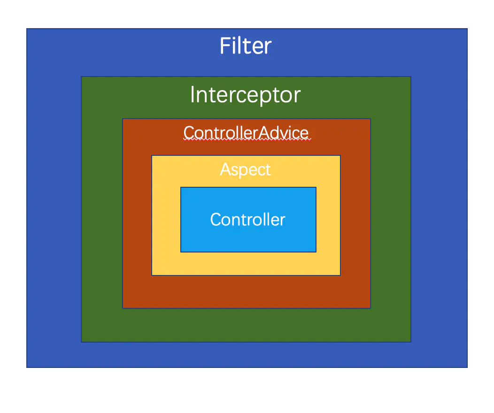

# Spring Controller


---

## 服务器控制

### 响应架构

Spring Boot 内集成了 Tomcat 服务器，也可以外接 Tomcat 服务器。通过控制层接收浏览器的 URL 请求进行操作并返回数据。

底层和浏览器的信息交互仍旧由 servlet 完成，服务器整体架构如下：


- **Server**： Tomcat 最顶层容器，代表整个服务器。

    - **Service**：服务，对应不同的任务。
    
        - **Connector**：有多个，用来处理连接相关的事情，并提供 Socket 到 Request 和 Response 相关转化。
        
        - **Container**：只有一个，用于封装和管理 Servlet ，以及处理具体的 Request 请求。


### 启动过程


main 方法： 实例化 SpringApplication ，执行run方法

run方法：  
    配置属性、获取监听器，初始化输入参数、配置环境，输出banner
    创建上下文、预处理上下文、刷新上下文、再刷新上下文：context

refreshApplicationContext方法：通过ServletWebServerFactory接口定义了getwebServer方法，通过其创建webServer并返回（创建时做了两件重要的事情：把Connector对象添加到tomcat中，配置引擎）【TomcatServletWebServerFactory是接口其中一个实现类】

TomcatwebServer类中，规定了Tomcat服务器的启动和关闭方法。

而tomcat的启动主要是实例化两个组件：Connector、Container

---


## Controller 实现

Controller 类需要使用 `@RestController` 或 `@Controller` 注解标注。

- `@Controller`：类中所有方法以 String 形式返回 classpath 路径下同名 html 页面。适用于 JSP/thymeleaf 等动态加载页面。

- `@RestController`：类中所有方法以 Map/List 等形式返回 JSON 数据。适用于前后端分离开发。

P.S. `@Controller` 类中标注 `@ResponseBody` 的方法，可以起到和 `@RestController` 类相同的效果。

### 请求映射

1. Controller 类中的方法使用 `@RequestMapping` 注解标注，就可以将指定 URL 请求映射到方法上处理。

```java
@RequestMapping(value = "/hello", method = RequestMethod.GET)     // 参数为 URL 路径和请求方式
@RequestMapping("/hello")                                         // 默认接收所有请求方式

@GetMapping("/hello")                                             // 简写形式的 GET 请求
@PostMapping("/hello")                                            // 简写形式的 POST 请求

// 灵活映射
@RequestMapping("/?/hello")                                       // ? 匹配单字符
@RequestMapping("/*/hello")`：                                    // * 匹配任意数量字符
@RequestMapping("/**/hello")：                                    // ** 匹配任意数量目录
@RequestMapping("/{ID}/hello")`                                   // {} 自动读取 URL 路径动态参数
```

2. Controller 类也可以通过 `@RequestMapping` 注解标注，表示路径下的 URL 请求在该类中寻找方法。

```java
@Controller
@RequestMapping("/speak")
public class SpeakController{
    @GetMapping("/hello")
    public String hello(){ return "hello"; } 
}
```


### GET 请求参数

GET 请求参数直接附着在 URL 中。对于请求 `/test?username=mrjoker&password=123456` ，Controller 方法有以下几种方式接收：

1. 直接获取参数

```java
@RequestMapping("/test")
public String test(String username, String password){
    return username + password;
}
```

2. 通过 HttpServletRequest 类来获取参数

```java
@RequestMapping("/test")
public String test(HttpServletRequest request){
    String username = request.getParameter("username");
    String password = request.getParameter("password");
    return username + password;
}
```

3. 通过自定义对象来获取参数

```java
@RequestMapping("/test")
public String test(User user){
    String username = user.getUsername();
    String password = user.getPassword();
    return username + password;
}
```

4. 通过 RequestParam 注解来获取参数，实参值赋给形参。

```java
@RequestMapping("/test")
public String test(@RequestParam(value="username",required = false, defaultValue ="mrjoker") String s1, @RequestParam("password") String s2){
    return s1 + s2;
}
```

5. 通过 PathVariable 注解来动态获取参数，参数直接附着在 URL 中。

```java
@RequestMapping("/test/{username}/{password}")
public String test(@PathVariable("username") String s1, @PathVariable("password") String s2){
    return s1 + s2;
}
```

6. 通过 ModelAttribute 注解来获取其他方法返回值作为参数，被注释方法会在此 controller 中每个方法执行前被执行。

```java
@Controller 
public class HelloWorldController { 
    @ModelAttribute 
    public void populateModel(@RequestParam String abc, Model model) { 
        model.addAttribute("attributeName", abc); 
    } 
 
    @RequestMapping(value = "/helloWorld") 
    public String helloWorld() { 
       return "helloWorld"; 
    } 
}
```

### POST 请求参数

POST 请求请求参数放置在请求体中，有以下两种格式：

- **Form Data 格式**
  
请求的 Content-Type 为 application/x-www-form-urlencoded

示例：`username=mrjoker&password=123456`

- **Request Payload 格式**
  
请求的 Content-Type 为 application/json 或者 multipart/form-data

示例：`{"username":"mrjoker", "password":"123456"}`


1. AJAX 提交 POST 请求默认使用 Form Data 格式，Spring MVC 会自动解析到对应的 bean 中并获取参数。

```java
// 逐个参数接收
@RequestMapping(value="/test", method=RequestMethod.POST)
private String test(@RequestParam("username") String username, @RequestParam("password") String password){
    return username + password;
}

// 解析为整体接收
@RequestMapping(value="/test", method=RequestMethod.POST)
private String test(User user){
    return user.getUsername() + user.getPassword();
}
```

2. Vue 提交 POST 请求默认使用 Request Payload 格式，Spring MVC 接收时必须进行处理：

    - 前端解决方案： axios 库可以使用 qs 库将 json 对象转化为 Form Data 格式。
    - 后端解决方案： Spring Boot 在请求参数上加 `@RequestBody` 注解，将请求正文解析到对应的 bean 中获取参数。

`@RequestBody` 可以直接以 String 接收前端传过来的 json 数据，也可以用对象自动解析前端传过来的 json 数据。对象里定义 List 属性，可用来接收多条 json 数据。

```java
// String 形式接收
@RequestMapping(value = "/test", method = RequestMethod.POST)
public String test(@RequestBody String user) {
    JSONObject userJson = JSON.parseObject(user);
    String username = userJson.getString("username");
    String password = userJson.getString("password");
    return username + password;
}

// 解析为对象接收
@RequestMapping(value = "/test", method = RequestMethod.POST)
public String updateClusterIdByClientAndQueue(@RequestBody User user) {
    return user.getUsername() + user.getPassword();
}
```


> 一个请求可以有多个 `@RequestParam`，但只能有一个 `@RequestBody`。 URL 内含有参数时，两者可以同时使用。


### 请求转发和重定向

1. **请求转发（forward）**

    客户端（浏览器）向服务器 A 发送一个 URL 请求，服务器 A 会向另一台服务器 B 获取资源并将此资源响应给浏览器。浏览器的 URL 地址仍然是 A 。
 
2. **重定向（Redirect）**

    客户端（浏览器）向服务器 A 发送一个 URL 请求，服务器 A 告知浏览器资源在服务器 B，浏览器会重新发送请求到服务器 B。浏览器的 URL 地址切换为 B。


```java
// 请求转发
@RequestMapping("/test1")
public String test1(){
    String type = 'forward';
    return "forward:/test2?type=" + type;
}

// 重定向
@RequestMapping("/test2")
public String test2(){
    String type = 'redirect';
    return "redirect:/test2?type=" + type;
}
```

在拦截器中，常通过修改 HttpSevletRequest 对象实现请求转发。

```java
request.getRequestDispatcher("login").forward(request,response);
```

---

## Controller 配置

Spring 的 WebMvcConfigurer 接口定义了 Controller 层配置信息（默认为空实现）。

开发者可以通过实现 WebMvcConfigurer 接口或继承 WebMvcConfigurationSupport 类对以下方法进行重写。

```java
@Configuration
public class WebMVCConfig implements WebMvcConfigurer {

    /** 解决跨域问题 **/
    @Override
    public void addCorsMappings(CorsRegistry registry){};
    /** 添加拦截器 **/
    @Override
    public void addInterceptors(InterceptorRegistry registry){};

}
```


### 跨域问题

配置如何处理跨域请求，否则返回数据会被浏览器拦截。

```java
@Override
public void addCorsMappings(CorsRegistry registry) {
            // 添加映射路径（全部）
    registry.addMapping("/**")
            // 放行哪些原始域
            .allowedOrigins("*")
            // 是否发送 Cookie 信息
            .allowCredentials(true)
            // 放行哪些原始域(请求方式)
            .allowedMethods("GET","POST", "PUT", "DELETE")
            // 放行哪些原始域(头部信息)
            .allowedHeaders("*")
            // 暴露哪些头部信息
            .exposedHeaders("Header1", "Header2");
}
```


**局部跨域**

1. `@CrossOrigin` 注解：在方法上（@RequestMapping）或者在控制器（@Controller）上使用，可以实现局部跨域。

```java
@RequestMapping("/hello")
@ResponseBody
@CrossOrigin("http://localhost:8080") 
public String index( ){
    return "Hello World";
}
```

2. 使用 HttpServletResponse 对象添加响应头实现局部跨域。

```java
@RequestMapping("/hello")
@ResponseBody
public String index(HttpServletResponse response){
    response.addHeader("Access-Control-Allow-Origin", "http://localhost:8080");         // 指定端口放行
    // response.addHeader("Access-Control-Allow-Origin", "*");                             全部放行
    return "Hello World";
}
```

### 拦截器 & 过滤器

- **拦截器(Interceptor)**

Java Web 中，在执行 Controller 方法前后对 Controller 请求进行拦截和处理。依赖于 web 框架，在 Spring 配置。在实现上基于 Java 的反射机制。

- **过滤器(Filter)**

Java Web 中，在 request/response 传入 Servlet 前，过滤信息或设置参数。依赖于 servlet 容器，在 web.xml 配置。在实现上基于函数回调。

> 两者常用于修改字符编码、删除无用参数、登录校验等。Spring 框架中优先使用拦截器：功能接近、使用更加灵活。


拦截器配置

```java
// 在配置中引入拦截器对象（单独编写拦截器类）

@Override
public void addInterceptors(InterceptorRegistry registry) {
    // 导入拦截器对象，默认拦截全部
    InterceptorRegistration addInterceptor = registry.addInterceptor(new myInterceptor());

    // 排除配置
    addInterceptor.excludePathPatterns("/error","/login","/user/login");               
    addInterceptor.excludePathPatterns("/asserts/**");                       
    addInterceptor.excludePathPatterns("/webjars/**");
    addInterceptor.excludePathPatterns("/public/**");
    // 拦截配置
    addInterceptor.addPathPatterns("/**");
}
```

拦截器类通过实现 HandlerInterceptor 接口或者继承 HandlerInterceptorAdapter 类。

```java
// 定义拦截器
public class myInterceptor extends HandlerInterceptorAdapter {

    // Session key
    public final static String SESSION_KEY = "user";

    // preHandle 预处理
    @Override
    public boolean preHandle(HttpServletRequest request, HttpServletResponse response, Object handler) throws Exception {
        // 检查 session
        HttpSession session = request.getSession();
        if (session.getAttribute(SESSION_KEY) != null) return true;
        // 重定向到登录页面
        request.setAttribute("message","登录失败，请先输入用户名和密码。");
        request.getRequestDispatcher("login").forward(request,response);
        return false;
    }

    // postHandle 善后处理
    @Override
    public void postHandle(HttpServletRequest request, HttpServletResponse response, Object handler,
                           ModelAndView modelAndView) {
        System.out.println("INTERCEPTOR POSTHANDLE CALLED");
    }

}
```

过滤器类通过继承 Filter 类实现，直接添加注解即可。

```java
@Component                                                                // 作为组件，交给容器处理
@ServletComponentScan                                                     // 扫描组件
@WebFilter(urlPatterns = "/login/*",filterName = "loginFilter")           // 设定过滤路径和名称
@Order(1)                                                                 // 设定优先级（值小会优先执行）
public class LoginFilter implements Filter{

    @Override
    public void init(FilterConfig filterConfig) throws ServletException {
    }

    @Override
    public void doFilter(ServletRequest servletRequest, ServletResponse servletResponse, FilterChain filterChain) throws IOException, ServletException {
        // 过滤器前执行
        System.out.println("before");
        // 执行内部逻辑
        filterChain.doFilter(servletRequest,servletResponse);
        // 过滤器后执行
        System.out.println("after");
    }

    @Override
    public void destroy() {
    }
}
```


**调用顺序**



---


### Spring Boot配置HTTPS

####生成SSL证书

https://www.cnblogs.com/benwu/articles/4891758.html

JDK提供证书管理工具: JDK\bin\keytool.exe 

<font size =2 color = green>Tomcat使用Java提供的密码库，通过Java的Keytool工具生成JKS等格式的证书文件。
Apache使用OpenSSL提供的密码库，生成PEM、KEY、CRT等格式的证书文件。</font>

**cmd命令(JDK\bin目录打开)**

密钥库: 保存密钥和对应的证书。【证书只含有公钥】

<font size =2 color = blond>genkeypair 生成密钥对（非对称加密算法）
genseckey 生成密钥（对称加密算法）
</font>
创建名为tomcat的密钥对以及自签名的证书，放入mykeystore密钥库中（不存在则创建）
`keytool -genkeypair -alias "tomcat" -keyalg "RSA" -validity 180 -keypass "123456" -keystore "D:\mykeystore.keystore" -storetype PKCS12 -storepass `


- alias 证书别名
- keyalg 加密算法，生成密钥对默认RSA
- keysize 密钥键长，RSA默认2048
- validity 证书有效期，默认90
- keypass 证书密码
- keystore 密钥库路径，默认创建在用户目录下
- storetype 密钥库类型，默认JKS
- storepass 密钥库密码

查看密钥库
`keytool -list -v -alias tomcat -keystore "D:\mykeystore.keystore" -storepass 123456 `

将生成的证书文件拷贝到项目resources目录下


####修改全局配置文件

application.properties格式

```properties
server.port = 8443
server.ssl.key-store = classpath:mykeystore.keystore
server.ssl.key-store-password = 123456
server.ssl.keyStoreType = PKCS12
server.ssl.keyAlias = tomcat
```

设置SSL后，默认使用HTTPS协议。访问localhost:8443，会出现证书安全提示，强行进入即可。
<font size =2 color = brown>【未付费注册，不被数字认证机构CA认可：会被浏览器标记为不安全】</font>

如果将服务器端口号设置成443端口,即https的默认访问端口,那么在进行https访问的时候可以不带端口号直接访问。

**修改入口文件**

如果访问http://localhost:8443，则提示需要TLS。

》》将http连接自动转换为https连接

```java
@Configuration
public class TestSslApplication {
    //servlet容器，自己写的bean会覆盖自动配置的bean？
    @Bean
    public ServletWebServerFactory servletContainer() {
        TomcatServletWebServerFactory tomcat = new TomcatServletWebServerFactory();
        tomcat.addAdditionalTomcatConnectors(createStandardConnector());
        return tomcat;
    }

　　// 新建connecter监听80端口，并重定向至8443
    private Connector createStandardConnector() {
        Connector connector = new Connector("org.apache.coyote.http11.Http11NioProtocol");
        connector.setScheme("http");
        connector.setPort(80);
        connector.setSecure(false);
        connector.setRedirectPort(8443);
        return connector;
    }

}

```


重新配置Servlet容器(Tomcat)

自动配置类ServletWebServerFactoryAutoConfiguration会读取bean

https://www.jianshu.com/p/017a7f40efff

