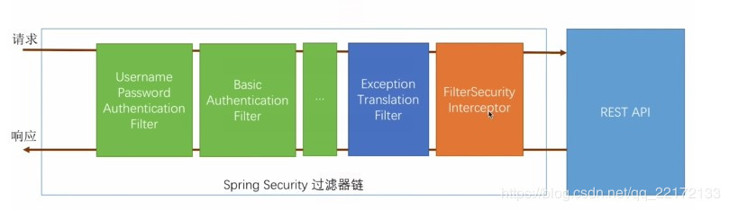

# Spring Security 


https://www.jianshu.com/p/4cee4b19ec40


## 基本概念


spring security 的核心功能主要包括：

认证 （你是谁）
授权 （你能干什么）
攻击防护 （防止伪造身份）


其核心就是一组过滤器链，项目启动后将会自动配置。最核心的就是 Basic Authentication Filter 用来认证用户的身份，一个在spring security中一种过滤器处理一种认证方式。





```xml
    <dependency>
        <groupId>org.springframework.security</groupId>
        <artifactId>spring-security-test</artifactId>
        <scope>test</scope>
    </dependency>
```


## 配置

Spring Security 的配置类，通过继承 `WebSecurityConfigurerAdapter` 类实现，可以重写一下三种方法。

```java
@Configuration
@EnableWebSecurity
@EnableGlobalMethodSecurity(prePostEnabled = true)
public class WebSecurityConfig extends WebSecurityConfigurerAdapter {
    @Override
    public void configure(AuthenticationManagerBuilder auth) throws Exception {
        //我代表代码
    }
    @Override
    public void configure(HttpSecurity http) throws Exception {
        //我代表代码
    }
    @Override
    public void configure(WebSecurity web) throws Exception {
        //我代表代码
    }
}
```

### 配置全局信息


`AuthenticationManagerBuilder` 类用来配置全局的认证相关的信息：

1. `AuthenticationProvider` ：认证服务提供者
2. `UserDetailsService` ：认证用户（及其权限）

```java
    @Override
    public void configure(AuthenticationManagerBuilder auth) throws Exception {
        // 添加后门
        auth.authenticationProvider(backdoorAuthenticationProvider);
        // 自定义AuthenticationProvider实例加入AuthenticationManager
        auth.userDetailsService(backendSysUserDetailsServiceImpl).passwordEncoder(new BCryptPasswordEncoder());
        auth.authenticationProvider(backendSysUserAuthenticationProvider);
    }
```


### 权限控制

`HttpSecurity` 类负责具体的权限控制规则配置。每配置相当于 xml 配置中的一个标签。


各种具体的认证机制的相关配置，OpenIDLoginConfigurer、AnonymousConfigurer、FormLoginConfigurer、HttpBasicConfigurer
LogoutConfigurer
RequestMatcherConfigurer：spring mvc style、ant style、regex style
HeadersConfigurer：
CorsConfigurer、CsrfConfigurer
SessionManagementConfigurer：
PortMapperConfigurer：
JeeConfigurer：
X509Configurer：
RememberMeConfigurer：
ExpressionUrlAuthorizationConfigurer：
RequestCacheConfigurer：
ExceptionHandlingConfigurer：
SecurityContextConfigurer：
ServletApiConfigurer：
ChannelSecurityConfigurer：
此模块的authenticationProvider和userDetailsService；
SecurityFilterChain控制。

```java
    @Override
    public void configure(HttpSecurity http) throws Exception {
         http
                .authorizeRequests()
                .antMatchers("/",
                        "/index",
                        "/error"
                ).permitAll()
                .antMatchers("/user/**").hasRole("USER")
                .antMatchers("/admin/**").hasRole("ADMIN")
                .and()
                .formLogin().loginPage("/login").defaultSuccessUrl("/user")
                //TODO 自定义参数名称，与login.html中的参数对应
                .usernameParameter("myusername").passwordParameter("mypassword")
                .and()
                .logout().logoutUrl("/logout").logoutSuccessUrl("/login")
                //鉴权
                .and()
                .authorizeRequests()
                .withObjectPostProcessor(new ObjectPostProcessor<FilterSecurityInterceptor>() {
                    @Override
                    public <O extends FilterSecurityInterceptor> O postProcess(O object) {
                        object.setSecurityMetadataSource(backendSysRoleSecurityMetadataSourceImpl);
                        object.setAccessDecisionManager(backendSysRoleAccessDecisionManagerImpl);
                        return object;
                    }
                });
    }

```


### 忽略规则配置

`WebSecurity` 类负责全局请求忽略规则配置（比如静态文件、注册页面）、全局 HttpFirewall 配置、是否debug配置、全局SecurityFilterChain配置、privilegeEvaluator、expressionHandler、securityInterceptor。

```java

    @Override
    public void configure(WebSecurity web) throws Exception {
         web.ignoring().antMatchers("/css/**", "/js/**");
    }
```


