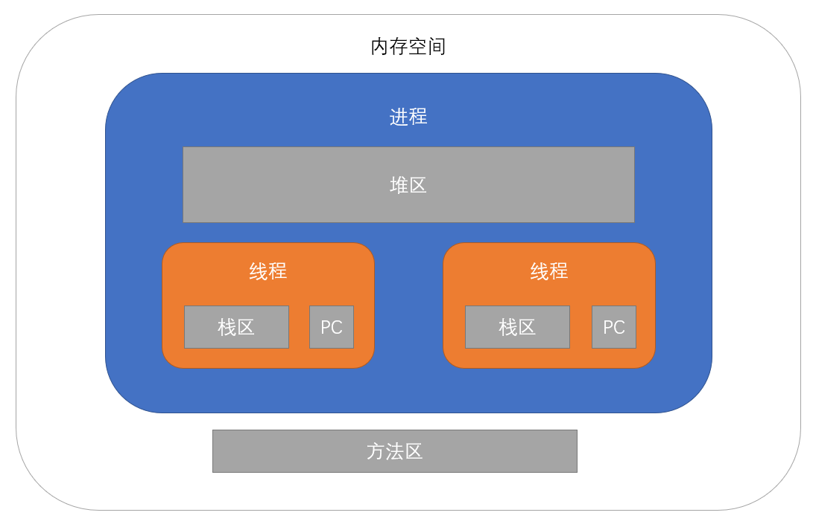

# JVM

Java 程序中的内存分配和回收都由 JVM 管理，不支持程序员直接对内存地址进行操作。不容易出现内存泄漏和内存溢出问题。

---

## 内存空间

进程是分配资源的基本单位。除方法区外，所有数据均存放在给进程分配的内存块中。

Java 程序的内存空间主要分为以下几个区域：



### 方法区 

(Method Area) 存放 **Java 程序的二进制代码，即类的信息**。

在虚拟机启动时直接存入系统内存中，大小只受系统内存的限制。


### 堆区

(Heap) 存放进程创建的**对象实例和数组**。

由线程共享，在虚拟机启动时为进程创建，是占用内存最大的区域。

#### 常量池

存放 **final 常量、static 变量和方法，以及 String 和部分包装类型的对象（一经赋值不再改变）**。

> JDK 1.7 后 JVM 将常量池从方法区中移出，改为在堆中开辟空间存放。

### 栈区   

(Stack) 存放线程执行 Java 方法调用的内存数据。线程每执行一个方法都会创建一个栈帧放入栈区，在方法执行结束后弹出。栈帧中储存局部变量表、操作数栈、动态链接、方法出口信息。其中局部变量表存放**线程和方法的参数、方法中定义的基础类型变量和对象引用**。

由线程私有。生命周期随着线程的创建而创建，随着线程的结束而死亡。

*栈区分为虚拟机栈（执行 java 方法）和本地方法栈（执行 native 方法，底层用 C 实现），但在 HotSpot 虚拟机中两者合二为一。*

### 程序计数器

用来记录线程的运行状态、管理线程的运行。

1. 字节码解释器通过改变程序计数器来依次读取指令，从而实现代码的流程控制，如：顺序执行、选择、循环、异常处理。

2. 在多线程的情况下程序计数器用于记录当前线程执行的位置，从而当线程被切换回来的时候能够继续运行。

由线程私有。生命周期随着线程的创建而创建，随着线程的结束而死亡。

---


## 对象的内存分配

### 分配空间

Hotspot 虚拟机中，对象在内存中分为 3 块区域：对象头、实例数据和对齐填充。

- 对象头负责记录对象信息，包括对象运行数据（哈希码、GC 分代年龄、锁状态标志等）和 类型指针（对象所属的类）。 
- 对象起止地址必须是 8 字节整数倍，空余部分将使用对齐填充来补全。

### 分配过程

在 Java 中创建对象，需要经过以下过程：
 
**Step 1. 类加载检查**
  
    JVM 接收到 new 指令，首先检查该类是否在常量池中，然后检查该类是否已被加载、解析和初始化。

    如果没有则先加载类，类加载器会将类的字节码文件放入 JVM 解析。

**Step 2. 分配内存**

    类加载后，会从 Java 堆中划分一块固定大小的内存区域分配给对象。

**Step 3. 半初始化**

    内存分配完成后，虚拟机将对象的实例数据都半初始化为默认值。此时对象已经可用。

**Step 4. 设置对象头**

    初始化内存空间后，虚拟机要对对象进行必要的设置，把信息存放在对象头中。

**Step 5.初始化对象**

    新的对象已经产生，但所有的字段都为默认值。接下执行 init 方法，将对象的实例数据赋值。

**Step 6. 建立关联**

    将对象引用指向创建的对象。该对象可以通过引用被使用。


*在创建对象的过程中可能会发生指令重排序。如果尚未完全初始化就建立了关联，其他线程读取该对象可能会读取到默认值。*

### 分配方式

内存划分有以下两种分配方式：

- 指针碰撞：（内存规整时） 已使用内存和未使用内存用指针隔开，需要分配内存时将指针移动一定位置。
- 空闲列表：（内存不规整时）虚拟机维护一个列表记录空闲内存块，需要分配内存时选择合适的内存块。

Java 堆是否规整，取决于垃圾收集算法是否整理内存。

---

## 常量池内存分配

### String 类

String 对象创建后一经赋值不再改变，有以下两种创建方式：

1. 直接赋值：如果常量池没有，则在常量池新建对象。否则直接使用常量池中已有对象，**引用指向常量池。**

2. 构造方法：如果常量池没有，则在常量池新建对象。无论如何一定会在堆区创建对象，**引用指向堆区。**


```java
String str1 = "string";                       // 引用指向常量池
String str2 = "str" + "ing";                  // 引用指向常量池

String str3 = new String("string");           // 引用指向堆区
String str4 = str1 + str2;                    // 引用指向堆区

System.out.println(str1 == str2);             // true
System.out.println(str1 == str3);             // false
```


### 包装类型

JVM 将部分常用的包装类型数据提前缓存在常量池中，用户创建该类对象时直接在常量池取用，而不用真正新建对象。

- **布尔包装类 Boolean**：将全部缓存数据保存在常量池中。

- **字符包装类 Character**：将 ASCII 字符(0-127) 数据缓存保存在常量池中。如果是汉字等其他字符仍然会创建对象。

- **整型包装类 Byte/Short/Integer/Long**：将数值 [-128，127] 内的数据缓存保存在常量池中。但是超出此范围仍然会去创建新的对象。

- **浮点数类型包装类 Float/Double**： 没有实现常量池技术。


---

## 内存过载

随着 Java 程序的使用，所占用和分配的内存将会越来越大。如果 JVM 已无法分配足够的内存，将会抛出 OutOfMemoryError 导致程序崩溃。

同时为了更合理地使用内存，Java 会由虚拟机对堆区内存空间自动进行垃圾回收。