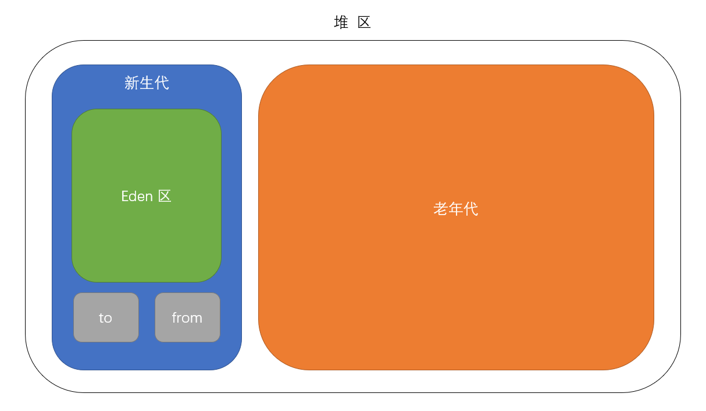

# 虚拟机

---

## 垃圾回收

Java 的自动内存管理主要是针对对象内存的回收和对象内存的分配，堆区是垃圾收集器管理的主要区域。

开发者使用 System.gc() 方法可以提醒 JVM 进行垃圾回收，但不能强制。

### 分区回收

现在收集器基本都采用分代垃圾收集算法，所以 Java 堆还可以细分为：新生代和老年代。进一步划分的目的是更好地回收内存，或者更快地分配内存。

- 新生代 GC (Minor GC) ：新生代垃圾回收非常频繁，回收速度也比较快。
+ 老年代 GC (Major GC) ：老年代垃圾回收次数较少，回收速度也明显更慢。

### 初次分配对象

新生代分为 eden 区和 survive 区， 其中 eden 区占用内存空间更大。

大多数情况下，对象在新生代 eden 区分配。当 eden 区没有足够空间进行分配时，虚拟机将发起一次 Minor GC。

### 长期存活对象

虚拟机给每个对象设置一个年龄计数器。如果对象经过一次 Minor GC 后仍然能够存活，将从 eden 移动到 survive 空间中。对象每熬过一次 Minor GC，年龄就增加 1 岁。当它的年龄增加到一定程度（默认为 15 岁），就会晋升到老年代。

survive 区分为 from 区和 to 区两块大小相等的内存空间。Minor GC 执行时，会将 eden 区和 from 区中的存活对象复制到 to 区，清除 eden 区和 from 区内存。再把这些存活对象从 to 区移动回 from 区。

当老年代也没有足够空间进行分配时，虚拟机将发起一次 Major GC。

### 大对象

需要大量连续内存空间的对象（如字符串、数组）直接进入老年代，可以避免为大对象分配内存时由于分配担保机制带来的复制而降低效率。

