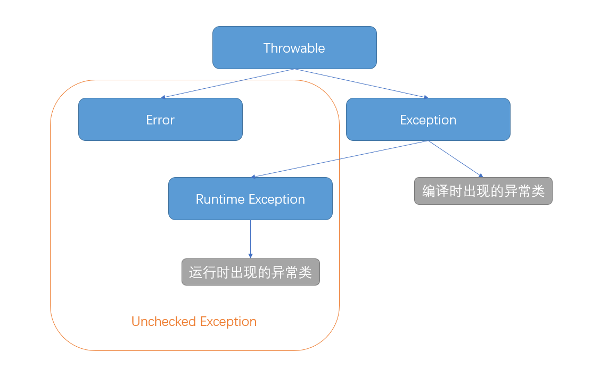

# 异常

---

## 异常类型

### Throwable 类

Java 程序中的异常是一个在程序执行期间发生的事件，它中断正在执行程序的正常指令流。为了能够及时有效地处理程序中的运行错误，必须使用异常类。

java 程序中所有的异常都继承自 Throwable 类，Throwable 类有两个子类 Error 类和 Exception 类：

- **Error 类**：【错误】表示 java 程序在运行时产生的无法处理的故障（如堆栈溢出），错误出现时会导致程序无法正常执行并强制退出。

- **Exception 类**：【异常】表示 java 程序中产生的可以被处理的故障，异常出现时可以由程序进行处理。




### RuntimeException 类 
   
【运行时异常】 Exception 类的子类。

表示 java 程序运行状态中发生的异常，在编译时无法被检测。在 java 程序运行时会由系统自动抛出，允许应用程序不进行处理。

 异常类型 | 介绍
- | -
ArithmeticException	|算术异常，以零做除数
ArrayIndexOutOfBoundException	|数组越界异常
NullPointerException	|空指针异常，对象不存在

### Checked Exception 类

【可检查异常】Exception 类除 RuntimeException 以外其他子类的统称。

表示 java 程序编译时检测到的异常。出现时必须在程序中进行捕获或抛出，否则编译不会通过。

 异常类型 | 介绍
- | -
IOException	|IO 异常
FileNotFoundException	|找不到文件异常，继承自 IO 异常
ClassNotFoundException	|找不到类异常

---

## Exception 类

### 源码解析

**状态信息**

Throwable / Exception 类是有状态的（因此 Throwable 是接口而不能是类），记录了四个信息：

```java
private transient Object backtrace;                          // 栈的回溯点
private String detailMessage;                                // 异常的信息：在创建异常时备注
private Throwable cause = this;                              // 异常的原因：导致该异常的异常，默认为自身
private StackTraceElement[] stackTrace = UNASSIGNED_STACK;   // 异常的发生顺序：以栈的形式存储
```

**构造方法**

Throwable / Exception 类含有四个构造方法，在创建时可以记录异常信息：

```java
throw new Exception();                           // 默认
throw new Exception("message");                  // 记录异常信息
throw new Exception(e);                          // 记录异常原因
throw new Exception("message", e);               // 记录详细信息和异常原因
```

**常用方法**

Throwable / Exception 类定义了多种常用方法用于获取异常数据，常用的有：

- getMessage 方法：获取异常的信息。
- getStackTrace 方法：获取的异常发生顺序。
- printStackTrace 方法：获取异常的发生顺序并打印（开发和调试阶段用来显示异常信息，帮助开发者找出错误）。

```java
catch(Exception e){
    System.out.println(e.getMessage());
    e.printStacTrace();                           
}
```

### 自定义异常

我们也可以通过继承并重写 Exception / RuntimeException 类的方式，自定义异常类并使用。

```java
// 自定义异常，重写方法可任选
class MyException extends Exception {
    @Override
    public MyException() {
        super();
    }
    @Override
    public MyException(String message) {
        super(message);
    } 
    @Override
    public MyException(String message, Throwable cause){
        super(message,cause);
    }
    @Override
    public MyException(Throwable cause) {
        super(cause);
    }
}
```

### 异常转译

在项目开发过程中，当 Sevice/DAO 层出现如 SQLException 异常时，程序一般不会把底层的异常传到 controller 层。程序可以捕获原始异常，然后再抛出一个新的业务异常。

```java
catch(SQLException e){
    throw new MyException("SQL Error", e);
}

```


---

## 异常处理

### 抛出异常 throw

当方法执行出现问题时，方法就会创建异常对象并抛出。开发者可以在程序中自行抛出异常；JVM 在执行程序时发现问题也会自动抛出异常。

- **throw 语句**：开发者自行创建异常对象并抛出，等待程序进行异常处理。

- **throws 语句**：声明方法可能抛出某种异常且未经处理，调用该方法的上级需要进行异常处理。

```java

class TestException{       
    // 把方法中的抛出异常交给上层处理     
    public void writeList(int size) throws IndexOutOfBoundsException, IOException{
        PrintWriter out = null;
        // 用户自定义异常并抛出
        if(size < 1) throw new IndexOutOfBoundsException("至少要输出1个字符");
        try{
            // 虚拟机自动发现异常也会抛出，必须出现在 try 代码块中
            out = new PrintWriter(new FileWriter(txt));
            for (int i = 0; i < size; i++)
                System.out.println("Value at: " + i + " = " + list.get(i));
        }finally{
            if (out != null) out.close();
        }
     }
}
```

### 捕获异常 catch

当方法执行抛出异常时，必须由专门的代码块对异常进行处理。

- **try 语句**：可能出现异常的代码块。

- **catch 语句**：捕获相应异常后停止执行 try 代码，转而执行对应 catch 代码。如果没有异常 catch 代码不会执行。

- **finally 语句**：无论是否发生异常，finally 代码总会被执行。一般用于释放资源。

**注意事项**

1. 如果 try 语句中出现的异常未被 catch，默认将异常 throw 给上层调用者处理。但必须在方法中声明 throws。

2. try/catch 代码中的 return 语句会在执行完 finally 后再返回，但 finally 中对返回变量的改变不会影响最终的返回结果。
   
3. finally 代码中应避免含有 return 语句或抛出异常，否则只会执行 finally 中的 return 语句，且不会向上级抛出异常。

*Java 7 后在 try 语句中打开 IO 流，会在跳出后自动关闭流。不必再用 finally 语句关闭。*


```java
class TestException{               
    public void writeList(int size) {
        PrintWriter out = null;
        try {
            if(size < 1) throw new IndexOutOfBoundsException("至少要输出1个字符");
            out = new PrintWriter(new FileWriter("OutFile.txt"));
            for (int i = 0; i < size; i++)
                System.out.println("Value at: " + i + " = " + list.get(i));
        } catch (IndexOutOfBoundsException e) {
            System.err.println("Caught IndexOutOfBoundsException: " + e.getMessage());
        } catch (IOException e) {
            System.err.println("Caught IOException: " + e.getMessage());
        } finally {
            if (out != null) out.close();
        }
    }
}
```

---
<!--

**异常处理类**

在 Spring Boot 中，所有异常统一由专门的异常处理类`@ControllerAdvice`处理。

```java
//控制器异常处理类
@ControllerAdvice 
public class ErrorHandler {
    
    private static final org.slf4j.Logger log = LoggerFactory.getLogger(ErrorHandler.class);
    
    //输入参数校验异常
    @ExceptionHandler(value = MethodArgumentNotValidException.class)
    public ResponseEntity<Result> NotValidExceptionHandler(HttpServletRequest req, MethodArgumentNotValidException e) throws Exception {
        
        log.debug("异常详情", e);
        BindingResult bindingResult = e.getBindingResult();
        
        //rfc4918 - 11.2. 422: Unprocessable Entity          
        Result res = MiscUtil.getValidateError(bindingResult);
        return new ResponseEntity<Result>(res, HttpStatus.UNPROCESSABLE_ENTITY);
    }
    
    //404异常处理
    @ExceptionHandler(value = NoHandlerFoundException.class)
    public ResponseEntity<Result> NoHandlerFoundExceptionHandler(HttpServletRequest req, Exception e) throws Exception {
        
        log.debug("异常详情", e);
                
        Result res = new Result(404, "页面不存在");
        return new ResponseEntity<Result>(res, HttpStatus.NOT_FOUND);
    }
    
    //其他默认异常处理
    @ExceptionHandler(value = Throwable.class)
    public ResponseEntity<Result> defaultHandler(HttpServletRequest req, Exception e) throws Exception {
                
        Result res = new Result(500, "服务器内部错误");
        log.debug("异常详情", e);
        
        return new ResponseEntity<Result>(res, HttpStatus.INTERNAL_SERVER_ERROR);
    }
}
```
-->
