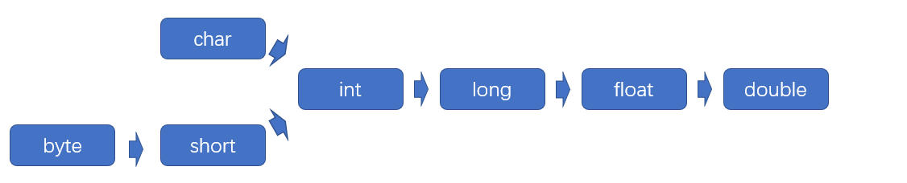

# 数据类型

---

## 基本类型

### 基本类型

Java 语言提供了八种基本类型，用户无需定义也可以直接使用。其数据保存在相应的方法栈中。

基本数据类型|字节数|默认值|包装数据类型|备注
 -| - | - | - | -
byte|1|0|Byte
short|2|0|	Short
int|	4|	0|Integer
long|8|0|	Long
float|	4|	0.0f |Float|数字后加f
double|	8|	0.0|Double
char|	2|	null|Character|必须用单引号
boolean	|1|	false|	Boolean

- **布尔型**

boolean 类型只含有两个值：true 和 false。字节存储为 11111111 和 00000000 。

```java
boolean b = true;      
boolean b = false;   
```

- **字符型**

char 类型使用单引号来表示字符。因为 Java 统一采用 unicode 编码，2 字节可以表示一字符。char 类型同样可以用十六进制码保存汉字等特殊字符：'\u0000' - '\uffff'。

```java
char ch = 'a';      
char ch = '中';
char ch = '/u3089';   
```

- **整型和浮点型**

Java 没有无符号类型，所有数据都有符号。

1. 整型(byte/short/int/long) 用来表示整型数据。

2. 浮点型(float/double) 用来表示浮点数据，实际以指数形式存储，所以和实际值之间有偏差。

  - 为 float 类型赋值必须在数字后加 f，否则数字默认被识别为 double 类型，会导致赋值出错。

  - 数字基本类型都包含最大最小值常量，如 `Integer.MAX_VALUE` 和 `Integer.MIN_VALUE` .

  - 在浮点型有三个特殊数值表示溢出和出错：
    - `POSITIVE_INFINITY` ：正无穷大，正数除以 0 可以得到。
    - `NEGATIVE_INFINITY` ：负无穷大，负数除以 0 可以得到。
    - `NaN` ：非数，零除以 0 可以得到。（两个 NAN 值也不相等）

```java
int n = 0;
float f = 0.0f;
long l = Long.MAX_VALUE;               
double d = POSITIVE_INFINITY;
```

### 包装类型

均继承自 Number 抽象类，把基本类型数据封装成对象。基本类型和包装类型之间会自动进行转化。

- **基本类型**（如int），是一个值。允许不赋初值，系统自动添加默认值。
  
- **包装类型**（如Integer），是一个对象。**实例化必须赋初值，且赋值后不能改变(final)。**


包装类型主要用于集合框架中的元素。但阿里巴巴要求所有实体类(POJO) 属性、远程过程调用方法(RPC) 的返回值和参数都必须使用包装数据类型。以此来提醒使用者在需要使用时，必须显式地进行赋值。


### 类型转换



对于基础类型：

- 按上图顺序可以自动进行类型转换。但整型转化为浮点型时，如果数据过大可能会导致数据丢失精度。

- 反之则必须进行强制类型转换。但务必小心，超出范围可能会产生意想不到的错误。

```java
int i = 'x';                  // 自动转换
char c = (char)60;            // 强制转换
```

但是包装类型之间的转换，需要使用特殊的方法。

```java
Integer i = l.intValue();
Long l = i.longValue();
```


---

## 数组 

### Array 类

数据的集合。本质是一个对象，数据存储在堆区，由引用指向数组首个元素的地址。

#### 创建数组

创建数组时，必须确定数组长度和类型。但如果储存的是基本类型，允许不赋初值（使用默认值）。

```java
int[] arr = new int[4];                    // 方法一
int[] arr = {1,2,3,4};                     // 方法二
int[] arr = new int[]{1,2,3,4};            // 方法三
```

**数组长度**：在数组对象中，定义了 length 属性记录了数组长度。

```java
int len = arr.length;                      // 返回数组长度  
```


### Arrays 类

对数组进行操作的辅助类，实现了对数组的常用操作。

#### 数组排序

**sort 方法**：可以对数组排序，默认数组数值从小到大排列，用户可以自定义排列顺序，

```java
Arrays.sort(arr);                                     // 数组排序
```

#### 数组复制

**copyOf/copyOfRange 方法**：复制数组。底层调用 System.arrayCopy 的本地方法实现，常用于数组扩容。

```java
int[] arr1 = Arrays.copyOf(arr, 10);                  // 复制数组：前 10 个单位
int[] arr2 = Arrays.copyOf(arr, 0, arr.length);       // 复制数组：从 0 到 arr.length - 1
```

#### 数组转化

**asList 方法**：将数组转化为列表（List 类），但数组数据必须是包装类型。

调用该方法将数组转换为列表后，在内存中实际还是以数组形式存储。这可能会导致以下两个问题：
1. 调用 List 类的 add 方法向列表中插入数据，会导致异常；
2. 对原数组进行更改，也会导致列表中的数据发生变化。


```java
arr[] = new Integer[]{1, 2, 3, 4};                    // 数组必须是包装数据类型

List list = Arrays.asList(arr);                       // 将数组转换为集合（有问题）               
List list = new ArrayList<>(Arrays.asList(arr));      // 将数组转换为集合（推荐）  
```

---

## 字符串

### String 类

保存字符串。String 类本质是一个 final 对象，由引用指向存储字符串对象的地址。引用虽然可变，但内存数据不能被更改。

#### 创建字符串

String 对象创建后一经赋值不再改变，有以下两种创建方式：

1. 直接赋值：如果常量池没有，则在常量池新建对象。否则直接使用常量池中已有对象，**引用指向常量池。**

2. 构造方法：如果常量池没有，则在常量池新建对象。无论如何一定会在堆区创建对象，**引用指向堆区。**


```java
String str1 = "string";                       // 引用指向常量池
String str2 = "str" + "ing";                  // 引用指向常量池（指向 str1 的字符串对象）

String str3 = new String("string");           // 引用指向堆区（在堆区新建字符串对象）
String str4 = str1 + str2;                    // 引用指向堆区

String newStr = new String(str.getBytes("ISO-8859-1"), "GBK");          // 获取指定类型编码对象，按指定类型编码
```

String 对象创建后一经赋值不再改变。对字符串数据进行改变，实际是创建新的 String 对象，并改变引用指向新的对象。

```java
str1 = "goodbye";                             // str1 指向新的字符串对象
```

#### 常用方法

```java
int len = str.length();                   // 返回字符串长度

String[] strs = str.split(",");           // 按分隔符分解字符串

boolean c = str.contains(str2);           // 判断是否存在子字符串
int index = str.indexOf(str2);            // 查找子字符串出现的第一个位置，没有返回-1
int index = str.lastIndexOf(str2);        // 查找子字符串出现的最后一个位置，没有返回-1

String str2 = str.trim();                 // 去除字符串左右空格　　
String str2 = str.substring(0,3);         // 截取指定位置（0-2）的子字符串
String str2 = str.replace("a", "b");      // 新字符 a 替换旧字符 b
```

#### 类型转换

```java
// Number > String

String s1 = data.toString();              // data 必须为包装数据类型
String s2 = Integer.toString(data);       // data 可以为基础数据类型，包括字符数组 char[]
String s3 = String.valueOf(data);         // data 可以为基础数据类型，包括字符数组 char[]

// String > char

char c = str.charAt(0);
char[] ch = str.toCharArray();

// String > int

int n1 = Integer.parseInt(str);          
int n2 = Integer.valueOf(str);
```


### StringBuilder / StringBuffer 类

由于 String 类不可变性，对其频繁更改往往会产生较多临时变量类，占用大量内存。对此我们通常使用 StringBuilder/StringBuffer 来避免，这两个类允许在原有内存地址对字符串进行操作。其中 StringBuilder 类性能更好，StringBuffer 类线程安全。


#### 创建字符串

必须通过构造方法创建，不可以直接赋值的形式创建：~~`StringBuffer str = "hello";`~~。

字符串默认长度为16，超出后会进行自动扩容。

```java
StringBuffer str = new StringBuffer("hello");
```

将 StringBuilder / StringBuffer 类转化为 String 类。

```java
String str2 = str.toString();    
```

#### 专用方法

StringBuilder / StringBuffer 类可以使用 String 类的全部方法，还新增了以下方法直接对字符串进行修改。

```java
str.append("add");                 // 末尾添加字符串，也可以是其他基础类型
str.insert(0,"insert");            // 指定位置插入字符串，也可以是其他基础类型
str.deleteCharAt(6);               // 删除指定位置（6）的字符
str.delete(6,8);                   // 删除指定位置（6和7）的字符串
str.reverse(str2);                 // 翻转字符串
```


---


## 大数

在 Java 程序中，我们可能会用到一些数值特别巨大、或者小数特别精确的数值，这些数值无法用基础类型表示。因此我们定义了 BigInteger/BigDecimal 类来保存这类数据，实际是以字符串形式在堆区存储。

### BigInteger 类

主要用来操作比 long 类型更大的整型数字。

### BigDecimal 类

基于 BigInteger 类实现。由于基本浮点数类型(float/double) 会产生精度丢失问题，因此常使用 BigDecimal 类代替。涉及金额必须使用该类。

```java
float x = 1.0f;                           // 约等于 0.1
float a = 1.0f - 0.9f;
float b = 0.9f - 0.8f;
System.out.println(a == b);               // false

BigDecimal a = new BigDecimal("1.0");     // 等于 0.1
BigDecimal b = new BigDecimal("0.9");
BigDecimal c = new BigDecimal("0.8");
BigDecimal x = a.subtract(b);
BigDecimal y = b.subtract(c);
System.out.println(x.equals(y));          // true
```

#### BigInteger 和 BigDecimal 类常用方法

```java
BigDecimal x = a.add(b);                  // 加
BigDecimal x = a.subtract(b);             // 减
BigDecimal x = a.multiply(b);             // 乘
BigDecimal x = a.divide(b);               // 除
BigDecimal x = a.abs();                   // 绝对值
a.compareTo(b);                           // 比较大小

// BigDecimal 类专用
BigDecimal x = y.setScale(3, rules);      // 设置精度和保留规则
```

## 枚举

### Enum 类

（JDK 1.5 新增）比 Class 类多了部分特殊约束的特殊类型，能更加简洁地定义常量。

使代码更具可读性，允许进行编译时检查，预先记录可接受值的列表，并避免由于传入无效值而引起的意外行为。

> 自定义枚举类实际是继承 Enum 类的 final 类，在类中将自定义该类型的 public static final 属性，并引入了相关方法。

```java
// 定义枚举类
public enum Day {
    MONDAY, TUESDAY, WEDNESDAY,
    THURSDAY, FRIDAY, SATURDAY, SUNDAY
}

// 使用枚举类
public class Demo {
    public boolean test(Day today){
        if(today == Day.MONDAY) return true;
        else teturn false;
    }
}
```

我们可以通过在枚举类型中定义属性,方法和构造函数让它变得更加强大。

*实际开发中，枚举类通常的形式是有两个参数（int code，Sring msg）的构造器，可以作为状态码进行返回。*

```java
public enum StatusCodeEnum{

    SUCCESS(200,"成功"), NOTFOUND(404,"未找到"), ERROR(500,"错误");
    
    private int code;
    private String message;

    // 根据常量自动构造
    private StatusCodeEnum(int code, String message) {
        this.code = code;
        this.message = message;
    }

    public int getCode() {
        return code;
    }

    public String getMessage() {
        return message;
    }

    @Override
    public String toString() {
        return "PinType{" +
                "code=" + code +
                ", message='" + message + '\'' +
                '}';
    }
}
```

根据常量自动构造对象并调用方法

`System.out.println(StatusCodeEnum.SUCCESS.getCode());`

---

## 时间

### 数字类型

在日常 Java 开发中，我们最常使用 Long 类型，而不是 Date/Timestamp 类型表示时间。

我们可以通过 System.currentTimeMillis 方法获取当前系统时间，默认为 13 位的数字（精确到 ms）。

```java
Long timestamp1 = System.currentTimeMillis();                 // 13 位 精确到 ms
Long timestamp2 = (System.currentTimeMillis()) / 1000;        // 10 位 精确到 s
```


---

## 泛型

### 泛型定义

定义类时并不固定数据类型，等到创建对象或调用方法时再明确数据类型。

[编译](javase/JVM/JVM介绍?id=java-运行原理)过程中，由编译器检查类型安全，自动隐性地对类的数据类型进行强制转换（Object -> 指定数据类型）。编译后生成的 字节码文件(.class) 将不再含有泛型。

### 泛型使用

可使用 A-Z 之间的任何一个字母，常用：
        
 - T (type)： 表示具体的一个 java 类型
 - K V (key value)： 分别代表 java 键值中的 Key Value
 - E (element)： 代表 java 集合框架元素
 - ？：表示不确定的 java 类

```java
// 定义时使用泛型
public class Box<T> {
    private T t;
    public void set(T t) {
        this.t = t;
    }
    public T get() {
        return t;
    }
} 

// 调用时明确类型
class Test{
    static void main(String[] args){
        Box<Integer> myBox = new Box<>();
        myBox.set(3);
        System.out.print(myBox.get());
    }
}
```