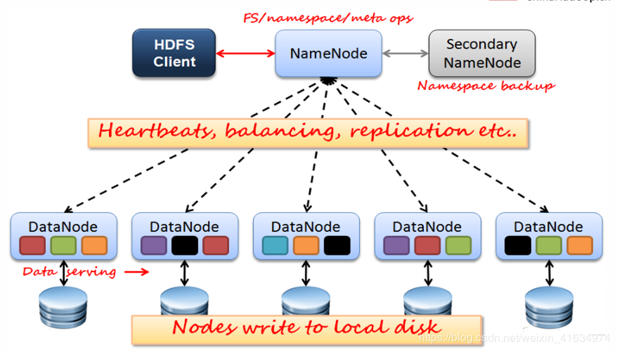

# Hadoop

## Hadoop 概念

### Hadoop 简介

Hadoop实现了一个分布式文件系统（Hadoop Distributed File System），简称HDFS。HDFS有着高容错性的特点，并且设计用来部署在低廉的（low-cost）硬件上。而且它提供高传输率（high throughput）来访问应用程序的数据，适合那些有着超大数据集（large data set）的应用程序。HDFS放宽了（relax）POSIX的要求（requirements）这样可以流的形式访问（streaming access）文件系统中的数据。

### Hadoop 架构

- HDFS: 分布式文件存储
- YARN: 分布式资源管理
- MapReduce: 分布式计算
- Others: 利用YARN的资源管理功能实现其他的数据处理方式

内部各个节点基本都是采用Master-Woker架构

## 分布式文件系统HDFS

### 基本概念

- **Block 数据块**

基本存储和读写单位，一般大小为 64M（不同文件的块大小可以不一致）。大文件会被拆分成一个个的块，然后存储于不同的机器。

配置大的块主要是因为：

1. 减少搜寻时间，一般硬盘传输速率比寻道时间要快，大的块可以减少寻道时间；
2. 减少管理块的数据开销，每个块都需要在NameNode上有对应的记录；
3. 对数据块进行读写，减少建立网络的连接成本.

- **DataNode**

保存具体的 block 数据，负责数据的读写操作和复制操作。

1. DataNode 启动时会向 NameNode 报告当前存储的数据块信息，后续也会定时报告修改信息。
2. DataNode 之间会进行通信，复制数据块，保证数据的冗余性

- **NameNode**

一个 Block 在 NameNode 中对应一条记录，保存数据块的具体存储信息，一般占用 150 字节。

运行时所有数据都保存到内存。数据会定时保存到本地磁盘，但不保存 block 的位置信息（DataNode 信息），而是由 DataNode 注册时上报和运行时维护，NameNode每次重启后动态重建。

NameNode 失效则整个 HDFS 都失效，所以使用 Secondary NameNode 定时与 NameNode 进行同步（定期合并文件系统镜像和编辑日志，然后把合并后的传给NameNode，替换其镜像，并清空编辑日志），但 NameNode 失效后仍需要手工将其设置成主机。

### Block 副本放置策略

每个块都会被复制到多台机器，默认复制3份.

第一个副本：放置在上传文件的DN；如果是集群外提交，则随机挑选一台磁盘不太满，CPU不太忙的节点。
第二个副本：放置在于第一个副本不同的 机架的节点上。
第三个副本：与第二个副本相同机架的其他节点。
更多副本：随机节点