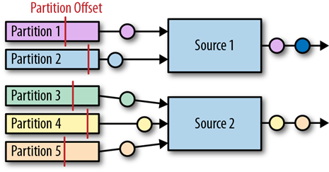

# 流处理器


---

## Spark Streaming

Spark 是一种快速、通用、可扩展的大数据分析引擎，已经发展成为一个包含多个子项目的集合。 Spark Streaming 是 Spark 的流处理部分。

Spark 的流处理是基于所谓微批处理的思想，把流处理看作是批处理的一种特殊形式，每次接收到一个时间间隔的数据才会去处理，所以天生很难在实时性上有所提升。

虽然在 Spark2.3 中提出了连续处理模型( Continuous Processing Model),但是现在只支持很有限的功能,并不能在大的项目中使用。 Spark还需要做出很大的努力才能改进现有的流处理模型想要在流处理的实时性上提升,就不能継续用微批处理的模式,而要想办法实现真正的流处理即每当有一条数据输入就立刻处理,不做等待。

### 数据类型

在内部，每个数据块就是一个 RDD，所以 spark streaming 有 RDD 所有优点，处理速度快，容错性好，支持高度并行计算。


### 操作流程

第一，我们将Spark Streaming类名和StreamingContext的一些隐式转换导入到我们的环境中，以便将有用的方法添加到我们需要的其他类（如DStream）中。StreamingContext是所有流功能的主要入口点。我们创建一个带有两个执行线程的本地StreamingContext，批处理间隔为1秒。

```java
public static void main(String[] args) throws InterruptedException {
    // 工作环境
    SparkConf conf = new SparkConf().setMaster("local[2]").setAppName("NetworkWordCount");     // 定义双线程 / APP 名称
    JavaStreamingContext jssc = new JavaStreamingContext(conf, Durations.seconds(1));          // 定义批处理时间间隔 1s
    // 流创建（从源导入）
    JavaReceiverInputDStream<String> lines = jssc.socketTextStream("localhost", 9999);
    // 流处理（数据分离、统计并打印）
    JavaDStream<String> words = lines.flatMap(x -> Arrays.asList(x.split(" ")).iterator());    
    JavaPairDStream<String, Integer> pairs = words.mapToPair(s -> new Tuple2<>(s, 1));
    JavaPairDStream<String, Integer> wordCounts = pairs.reduceByKey((i1, i2) -> i1 + i2);
    wordCounts.print();
    // 启动流运算
    jssc.start();
    jssc.awaitTermination();
}
```


#### DStream 对象

Spark Streaming 提供一个对于流数据的抽象 DStream。DStream 可以由来自 Apache Kafka、Flume 或者 HDFS 中的流数据生成，也可以由别的 DStream 经过各种转换操作得来。

底层 DStream 也是由很多个序列化的 RDD 构成，按时间片（比如一秒）切分成的每个数据单位都是一个 RDD。然后，Spark 核心引擎将对 DStream 的 Transformation 操作变为针对 Spark 中对 RDD 的 Transformation 操作，将 RDD 经过操作变成中间结果保存在内存中。

由于 Spark Streaming 将底层的细节封装起来了，所以对于开发者来说，只需要操作 DStream 就行。接下来，让我们一起学习 DStream 的结构以及它支持的转换操作。

#### StreamingContext 对象

任何 Spark Streaming 的程序都要首先创建一个 StreamingContext 的对象，它是所有 Streaming 操作的入口。StreamingContext 中最重要的参数是批处理的时间间隔，即把流数据细分成数据块的粒度。


用 `streamingContext.start()` 来开始接收数据并处理它
用 `streamingContext.awaitTermination()` 等待处理停止（手动停止或由于任何错误）
用 `streamingContext.stop()` 可以手动停止


一旦启动上下文，就无法设置新的流计算或将其添加到该流计算中
上下文一旦停止，就无法重新启动
一个JVM中只能同时激活一个StreamingContext
StreamingContext中的stop()也会停止SparkContext。但如果要仅停止StreamingContext的话，设置stop(false)
只要在创建下一个StreamingContext之前停止了上一个StreamingContext（不停止SparkContext），就可以将SparkContext重用于创建多个StreamingContext


## Spark 操作 kafka

Spark Streaming提供了两类内置的streaming源：

Basic sources ：直接在StreamingContext API中可用的源。例如，文件系统和socket连接
Advanced sources ：像Kafka，Flume，Kinesis等这样的源，可通过额外的程序类获得 

### 消费

1. 先把数据接收过来，转换为spark streaming中的数据结构Dstream。接收数据的方式有两种：1.利用Receiver接收数据，2.直接从kafka读取数据。

在spark1.3之后，引入了Direct方式。不同于Receiver的方式，Direct方式没有receiver这一层，其会周期性的获取Kafka中每个topic的每个partition中的最新offsets，之后根据设定的maxRatePerPartition来处理每个batch。

0.10以后只保留了direct模式(Reveiver模式不适合生产环境)，并且0.10版本API有变化（更加强大）

### 生产

与读数据不同，Spark并没有提供统一的接口用于写入Kafka，所以我们需要使用底层Kafka接口进行包装。
最直接的做法我们可以想到如下这种方式：

```java
input.foreachRDD(rdd =>
  // 不能在这里创建KafkaProducer
  rdd.foreachPartition(partition =>
    partition.foreach{
      case x:String=>{
        val props = new HashMap[String, Object]()
        props.put(ProducerConfig.BOOTSTRAP_SERVERS_CONFIG, brokers)
        props.put(ProducerConfig.VALUE_SERIALIZER_CLASS_CONFIG,
          "org.apache.kafka.common.serialization.StringSerializer")
        props.put(ProducerConfig.KEY_SERIALIZER_CLASS_CONFIG,
          "org.apache.kafka.common.serialization.StringSerializer")
        println(x)
        val producer = new KafkaProducer[String,String](props)
        val message=new ProducerRecord[String, String]("output",null,x)
        producer.send(message)
      }
    }
  )
)
```

但是这种方式缺点很明显，对于每个partition的每条记录，我们都需要创建KafkaProducer，然后利用producer进行输出操作，注意这里我们并不能将KafkaProducer的新建任务放在foreachPartition外边，因为KafkaProducer是不可序列化的（not serializable）。显然这种做法是不灵活且低效的，因为每条记录都需要建立一次连接。如何解决呢？

首先，我们需要将KafkaProducer利用lazy val的方式进行包装如下：

---

## Flink 

目前唯一同时支持高吞吐、低延迟、高性能的分布式流式数据处理框架。像Apache Spark也只能兼顾高吞吐和高性能特性，主要因为在Spark Streaming流式计算中无法做到低延迟保障。

**优势**

1. 支持事件事件概念。

2. 支持有状态计算，保持了事件原本产生的时序性，避免网络传输带来的影响。

3. 支持高度灵活的窗口操作，Flink将窗口分为Time、Count、Session以及Data-driven等类型的窗口操作，可以灵活的处罚条件定制化来达到对复杂的流传输模式的支持。

4. 基于轻量级分布式快照实现容错，将大型计算任务的流程拆解成小的计算过程，分布到并行节点上处理。并通过 Checkpoints 将执行过程中的状态信息进行持久化存储，可以自动恢复出现异常的任务。

5. 基于 JVM 实现独立的内存管理。


**运行环境**

- JDK 版本必须在 1.8 及以上
- Maven 版本必须在 3.0.4 及以上
- Hadoop 环境支持 hadoop 2.4、2.6、2.7、2.8 等主要版本

Flink 支持使用 Java/Scala 开发，以下示例代码全部使用 Java .

### 基本组件

1. Flink 架构体系基本上分三层（自顶向下）：

    - **API & Libraries 层**： 提供支撑流计算和批计算的接口，，同时在此基础上抽象出不同的应用类型的组件库。

    - **Runtime 核心层**：Flink分布式计算框架的核心实现层，负责分布式作业的执行、映射转换、任务调度等。将 DataStream 和 DataSet 转成同意的可执行的 Task Operator 。

    - **物理部署层**：目前Flink支持本地、集群、云、容器部署，Flink通过盖层能够支持不同平台的部署，用户可以根据需要选择使用对应的部署模式。

2. Flink 基本架构

    - **Client 客户端**：负责将任务提交到集群，与JobManager构建Akka连接，然后将任务提交到JobManager，通过和JobManager之间进行交互获取任务执行状态。

    - **JobManager**：负责整个Flink集群任务的调度以及资源的管理

    - **TaskManager**：相当于整个集群的Slave节点，负责具体的任务执行和对应任务在每个节点上的资源申请与管理。


### 编程模型

1.  BasicTypeInfo 数据类型：支持任意 Java 原生基本类型或 String 类型。

```java
// 直接获取
DataSource<String> inputStream= environment.fromElements("1", "2", "3", "4", "5", "6");

// 从集合获取
ArrayList<String> list = new ArrayList<>(list2);
DataSource<String> inputStream= environment.fromCollection(list);
```

2. TupleTypeInfo 数据类型：标识 Tuple 类型数据。

```java
DataSource<Tuple2> inputStreamTuple = environment.fromElements(new Tuple2("fangpc", 1), new Tuple2("fangpengcheng", 2));
```

3. PojoTypeInfo 数据类型：描述任意的 POJOs ，字段类型必须是上述基础类型，拥有默认构造方法和 getter/setter 方法

```java
var personStream = environment.fromElements(new Person("fangpc", 24), new Person("fangpengcheng", 25));
```


4. Value 数据类型：实现了org.apache.flink.types.Value，其中包括 read() 和 write() 两个方法完成序列化和反序列化操作，有着比较高效的性能。Flink 提供的内建 Value 类型有 IntValue、DoubleValue、StringValue 等。

5. 特殊数据类型：

    * Scala中的List、Map、Either、Option、Try数据类型
    * Java中Either
    * Hadoop的Writable数据类型


### 操作流程


```java
public class StreamingJob {

    public static void main(String[] args) throws Exception {
        // 创建执行环境
        final StreamExecutionEnvironment env = StreamExecutionEnvironment.getExecutionEnvironment();

        /******** 配置流过程 *********/
        addSource();         // 流创建

                             // 流转化
        /******** 配置流过程 *********/

        // 执行
        env.execute("Flink Streaming Java API Skeleton");

    }
}
```

**DataStreamSource 对象**是 DataStream 类的子类，代表着数据流的起始点。必须通过 addSource 方法生成, fromCollection/readTextFile 方法底层也会调用 addSource 方法。

**DataStream 对象**代表着相同类型元素的流，可以通过转换（transformation）来实现转换为另一个 DataStream 对象。DataStrem 对象内部持有当前的 StreamExecutionEnvironment 对象和 DataTransformation 对象。

**StreamExecutionEnvironment 对象**代表着当前流计算执行环境以及相关配置。每个 DataStream 类在做转换的时候，会首先创建转换对应的 DataTransformation 对象，最终形成一个 DataTransformation 链表被 StreamExecutionEnvironment 对象维护。


> Flink 在执行时，会把流拓扑（Source、Transformation、Sink）都转换为 DataFlow：由 Stream 和 Operator 组成，让 Stream在 Operator 中流动。


### 一致性


当在分布式系统中引入状态时，自然也引入了一致性问题。

在流处理中，一致性分为 3 个级别。

- **at-most-once**：故障发生之后，计数结果可能丢失。

- **at-least-once**：这表示计数结果可能大于正确值，但绝不会小于正确值。也就是说，计数程序在发生故障后可能多算，但是绝不会少算。

- **exactly-once**：这指的是系统保证在发生故障后得到的计数结果与正确值一致。

第一代流处理器（如 Storm 和 Samza）刚问世时只保证 at-least-once。最先保证 exactly-once 的系统（Storm Trident 和 Spark Streaming）在性能和表现力这两个方面付出了很大的代价。


---

## Flink 操作 kafka

https://zhuanlan.zhihu.com/p/92289771


flink 提供了一个特有的 kafka connector 去读写 kafka topic 的数据。这样在 flink 消费 kafka 数据时，就可以通过 flink 内部去跟踪 offset 和设定 checkpoint 去实现 exactly-once 的语义。

在 Flink 中，我们作为 Consumer 时需要用 Source Connectors 代表连接数据源的连接器，作为 Producer 时需要用 Sink Connector 代表连接数据输出的连接器。


### Source Connector

Flink Kafka connector 以并行的方式读入事件流，每个并行的 source task 都可以从一个或多个 partition 读入数据。Task 对于每个它当前正在读的 partition 都会追踪当前的 offset ，并将这些 offset 数据存储到它的 checkpoint 中。当发生故障进行恢复时，offset 被取出并重置，使得数据可以在上次检查点时的 offset 继续读数据。*Flink Kafka connector 并不依赖于 Kafka 本身的 offset-tracking 机制（也就是consumer groups机制）。*




```java
StreamExecutionEnvironment env = StreamExecutionEnvironment.getExecutionEnvironment()

// 设定配置
val properties = new Properties();
properties.setProperty("bootstrap.servers", "localhost:9092");
properties.setProperty("group.id", "test");

// 设置消费者并添加源
FlinkKafkaConsumer<String> myConsumer = new FlinkKafkaConsumer<String>(
    "topic",                                 
    new SimpleStringSchema(),                
    properties))   
);
DataStream[String] stream = env.addSource(myConsumer);                    
```

**初始化 FlinkKafkaConsumer 参数**

1. **topic 名字**，用来指定消费一个或者多个topic的数据，也可以是正则表达式。
2. **反序列化器(schema)**，对消费数据进行反序列化，转换成自定义的数据结构。
3. **kafka 配置信息**：如 zk 地址端口，kafka 地址端口等。此对象至少要包含两个条目 `bootstrap.servers` 与 `group.id`。


反序列化器主要通过实现 KeyedDeserializationSchema 或者 DeserializationSchema 接口来完成，flink 内置，也可以自定义。

- 转化为 String 类型 `SimpleStringSchema`
- 转化为其它类型 `TypeInformationSerializationSchema<T>`
- 转化为键值对类型 `TypeInformationKeyValueSerializationSchema<K, V>`
- 转化为 JSON 类型 `JSONKeyValueDeserializationSchema`


**消费起始位置**

Flink Kafka Consumer 可以配置指定的 Kafka Partition 的起始位置。

```java
myConsumer.setStartFromEarliest()             // start from the earliest record possible（默认）
myConsumer.setStartFromLatest()               // start from the latest record
myConsumer.setStartFromTimestamp(...)         // start from specified epoch timestamp (milliseconds)
myConsumer.setStartFromGroupOffsets()         // the default behaviour
```


### Sink Connector

Flink 提供为 Kafka 0.8 版本后所有 Kafka 版本的 sink connectors。


```java
// 设定数据流
DataStream[String] stream = environment.fromElements("1", "2", "3", "4", "5", "6");
 
// 设置生产者并添加到 sink
FlinkKafkaProducer<String> myProducer = new FlinkKafkaProducer<String>(
  "localhost:9092",                            
  "topic",                                     
  new SimpleStringSchema)                    
 
stream.addSink(myProducer)
```

**初始化 FlinkKafkaProducer 参数**

1. **broker 列表**，要发往的 brokers , 用逗号分割。
2. **topic 名字**，用来指定生产一个或者多个 topic 的数据，也可以是正则表达式。
3. **序列化器(schema)**，对消费数据进行序列化，将目标类型转换成字节数组。

序列化器类比于反序列化器实现：

- 转化为 String 类型 `SimpleStringSchema`
- 转化为其它类型 `TypeInformationSerializationSchema<T>`
- 转化为键值对类型 `TypeInformationKeyValueSerializationSchema<K, V>`
- 转化为 JSON 类型 `JSONKeyValueDeserializationSchema`


### Kakfa 容错机制

在 Kafka 0.9 之前不提供任何机制去保证 at-least-once 或 exactly-once 的语义。 但后续版本的 Kafka 可以通过以下方式来实现出错后恢复且不丢失数据：

1. **启用 Checkpoint**

在默认启用 Checkpoint 的状况下， FlinkKafkaConsumer 将消费来自 Topic 的记录，并以一致的方式周期性地 Checkpoint 其所有 Kafka Offset 以及其它操作的状态。万一作业失败，Flink 将把流失程序恢复到最新 Checkpoint的状态，并且重新消费 Kafka 中的数据。这确保了在 Kafka Broker 中所提交的 Offset 和 Checkpointed State 中的 Offset 是一致的。此时 FlinkKafkaProducer 可以提供 exactly-once 的投递语义。

如果 Checkpointing 没有启用，KafkaFlinkConsumer 将会周期性的提交 Offset 到 Zookeeper 中去。

- **配置 Semantic 参数**

除了启用 Flink 的 Checkpointing，还可以通过传递恰当的 semantic 参数给 FlinkKafkaProducer 选择 3 种不同的操作模式:

- `emantic.None` : Flink 什么也不会保证，所产生的记录可能会被丢失或者重复。
- `Semantic.AT_LEASET_ONCE`（默认）: Flink 保证 at-least-once ，没有记录会被丢失，但可能会重复。
- `Semantic.EXACTLY_ONCE` : 使用 Kafka 的事务机制来保证 exactly-once。

Semantic.EXACTLY_ONCE 模式依赖于提交事务的能力，这些事务是在 taking a checkpoint 之前，从该 Checkpoint 恢复之后启动的。如果 Flink 应用崩溃且完成重启的时间比 Kafka 事务超时的时间大，则数据将会丢失（Kafka 将自动的终止超过超时时间的事务）。请务必根据预期的故障时间来配置你的事务超时。

### kafka 分区发现

FlinkKafkaConsumer 支持发现动态创建的 Kafka Partition，并且以 exactly-once 语义保证来消费其中的数据。默认情况下分区发现是禁用的，要启用该特性在提供的属性配置中为参数 flink.partition-discovery.interval-millis 设置一个非负数的值，表示发现间隔（以毫秒为单位）。

