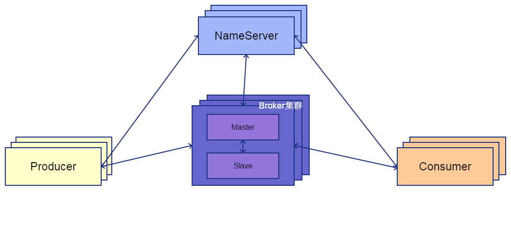
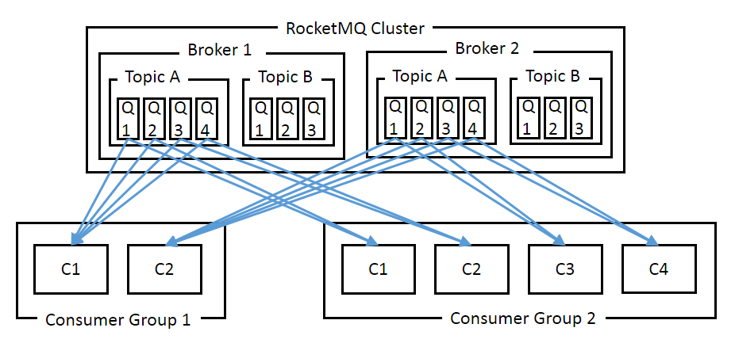
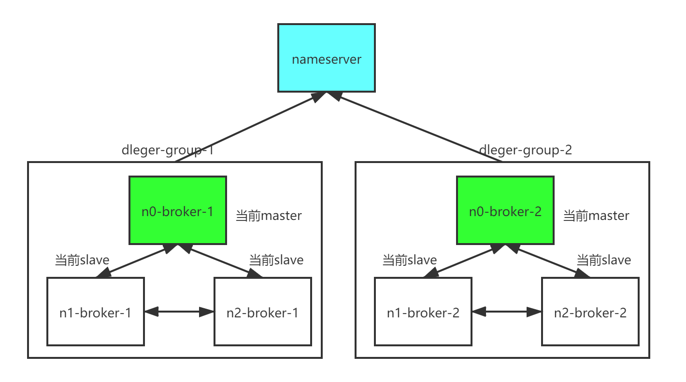

# Rocket MQ 

https://www.jianshu.com/p/0b4b1147366f

---

## Rocket MQ

### 基本介绍

阿里使用 Java 开发的开源消息中间件。被广泛应用在订单，交易，充值，流计算，消息推送，日志流式处理，binglog 分发等场景。

- **优势**：集群和 HA 实现都很简单。在保持一定的吞吐情况下，在发生宕机和其它故障时消息丢失率更低。因为无论是同步还是异步发送，生产者都会收到实时响应。适合处理高可靠性的数据。

- **劣势**：跟 kafka 相比吞吐率稍低。

### 整体架构




- `Producer`: 数据生产者，向 RMQ 集群生产数据。

- `Consumer`：数据消费者，连接 Broker 读取生产者生产的消息。

- `Broker`: Kafka 的服务节点，负责接收 Producer 生产的数据，在本地磁盘对数据进行备份，并提供数据给 Consumer。为最大化吞吐量 Broker 往往只起到中转和存储的作用而不处理业务逻辑。

- `NameServer`: 所有机器定时向 NameServer 上报自己的状态（超时未发送被剔除），NameServer 内部通过 5 个 HashMap 保存全局信息，提供给其它机器查询。NameServer 可以部署多个，相互独立。机器需同时向多个 NameServer 上报状态信息，从而达到热备份的目的。因为结构简单，无需使用专门的 zookeeper 注册中心来提供协调服务。


### 消费模型



RocketMQ 消息按照 `Topic` 和 `Tag` (可选)进行二级数据的组织和隔离，Producer/Consumer 会向指定的 Topic 甚至 Tag 收发数据。

Topic 可拥有若干个 `Queue` ，散落在不同的 Broker 上，从而达到了数据分布式存储的目的，具有水平扩展的能力。

消息均使用 message ID 唯一识别。 Rocket MQ 不对消息的格式做限制，消息 body 是二进制，需要用户完成序列化操作。用户在发送时可以设置 messageKey ，便于之后查询和跟踪。


在 RMQ 中消息的生产/消费均通过 Group （组）来完成，用来标记同一类生产/消费者，一般是集群部署。一个 Group 内可包含多个 Client （客户端）。

每个 `Consumer Group` 都会消费一个 Topic 全量的数据，彼此之间互不干扰。同一个 Consumer Group 下的 Consumer 只能消费到其中一部分 Partition ，通过多个 Consumer 可以达到并行消费的目的。Partition 数量推荐设为 Consumer 数量的整数倍，便于均分。

*Consumer 获取消息后，只有在消息消费完成时才会向服务器返回 ack 。如果没有消费完成，则一定不会 ack 消息。*


### 多副本模式



RMQ 采用多副本模式，将集群分为多个 `dleger-group` ，每个 group 由 3 台或以上 broker 组成。默认使用同步复制同步刷盘，master 要将消息同步到 slave 才会返回成功，保证 master-slave 的 commitlog 一致性。

定时线程会检测各 broker 状态，当前 master 挂掉后，会触发自动选主保证集群的读写能力不受影响。选主基于 raft 协议，默认会选择 offset 较大的 slave 为主节点，防止消息丢失。

Broker部署相对复杂，Broker分为Master与Slave，一个Master可以对应多个Slave，但是一个Slave只能对应一个Master，Master与Slave的对应关系通过指定相同的Broker Name，不同的Broker Id来定义，BrokerId为0表示Master，非0表示Slave。Master也可以部署多个。

每个Broker与Name Server集群中的所有节点建立长连接，定时(每隔30s)注册Topic信息到所有Name Server。Name Server定时(每隔10s)扫描所有存活broker的连接，如果Name Server超过2分钟没有收到心跳，则Name Server断开与Broker的连接。


### 导入依赖

```xml
<!-- 生产/消费客户端导入依赖-->
<dependency>
    <groupId>org.apache.rocketmq</groupId>
    <artifactId>rocketmq-client</artifactId>
    <version>4.3.1</version>
</dependency>
```

---

## 生产者

### 生产架构

在 RMQ 中消息的生产通过 ProduceGroup （生产组）完成。用来标记同一类生产者，一般是集群部署。

一个 ProduceGroup 内可包含多个 Client （客户端）。这是一个逻辑上的概念，使用唯一标识 ClientID （ClientIP + InstanceName）来相互区分，默认为 IP 地址 + 端口号。

用户创建的 Producer 类，如果 ClientID 相同将被视为同一个 Client ，在 Broker 上共用一个内部实例处理。


### 参数配置

在 DefaultMQProducer 类内，提供了以下参数给配置。

1. 继承 ClientConfig 类，和 Consumer 类互用。

字段 | 含义 | 默认值 | 备注
-|-|-|- 
String namesrvAddr | nameServer 地址列表 | 无 | 必填
String clientIP | Client IP | 本机 IP | 
String instanceName | client 名称  | 当前进程号 |
int clientCallbackExecutorThreads | 客户端收到请求处理线程数 | CPU 核数 | 没什么用
int pollNameServerInterval | 轮询 nameServer 时间 | 30000(ms) | 
int heartbeatBrokerInterval | 向 broker 发送心跳时间 | 30000(ms) | 
int persistConsumerOffsetInterval | 持久化消费进度间隔时间   | 5000(ms) | 
String groupName | 组名 | |  
String token | broker 认证 Client 身份 | |  

2. DefaultMQProducer 类独有


字段 | 含义 | 默认值 | 备注
-|-|-|-
String producerGroup | 生产组名 | | 只在事务消息中有用
String createTopicKey | 如果未找到 topic 需要自动创建，所用 topic key |  "TBW102" | 没什么用
int defaultTopicQueueNums | 如果未找到 topic 需要自动创建，默认 queue 数量 | 4 | 没什么用
int sendMsgTimeout | 发送超时时间，超出后抛出异常 | 3000(ms) |
int compressMsgBodyOverHowmuch | 超出大小对消息压缩 | 4096(B) |
int retryTimesWhenSendFailed | 普通消息重试次数|  2 |
int retryTimesWhenSendAsyncFailed | 异步消息重试次数 | 2 |
boolean retryAnotherBrokerWhenNotStoreOK | 结果不是 SEND_OK 是否当作失败重发 | false |
int maxMessageSize | 最大消息尺寸 | 4194304(128K) |


### 生产方式

生产者生产消息通常分为同步发送、异步发送、单向发送三种方式：

1. **同步生产 SYNC**

可靠性最强，但性能最低的发送方式。应用在发送消息后将等待返回值，再进行之后的处理。

常用于重要通知邮件、报名短信通知、营销短信系统等。

```java
public class JavaProducerExampleRMQ {

    public static void main(String[] args) throws Exception {

        // 设定生产者
        DefaultMQProducer producer = new DefaultMQProducer("produceGroupName");               // 设定生产组名
        producer.setNamesrvAddr("nameServer_1:9876;nameServer_2:9876");                       // 设定 NameServer 地址
        producer.setToken("token");                                                           // 设定 Token
        producer.start(); 

        // 消息设定
        List<Message> messageList = new ArrayList<>();
        for (int i = 0; i < 50; i++) {
            Message msg = new Message("topic" ,                                               // 设定 Topic 
                    "tag",                                                                    // 设定 Tag（可选）
                    "ORDER-20170101-XXX",                                                               // 设定 Key ，用于消息查询（可选）
                    ("Hello RocketMQ " + i).getBytes("UTF-8")                                 // 设定 Message body 
            );
            // 可以设定消息延迟发送，如超时未支付关闭订单
            // Level 从 1 - 18 依次为 1s 5s 10s 30s 1m 2m 3m 4m 5m 6m 7m 8m 9m 10m 20m 30m 1h 2h
            message.setDelayTimeLevel(2);                   
            messageList.add(msg);
        }

        // 发送消息并接收结果
        SendResult sendResult = producer.send(messageList);
        System.out.printf("%s%n", sendResult);
        producer.shutdown();
    }
}
```

2. **异步生产 ASYNC**

如果希望获取更好的性能，可以通过异步实现高并发。应用将不再等待返回值，而是通过回调触发相对应的业务。异步生产一旦发送失败，将不支持重试。且不保证消息发送严格有序。

可用于注册成功后通知积分系统发放优惠券。


```java
public class AsyncProducer {
    public static void main(String[] args) throws Exception {
        DefaultMQProducer producer = new DefaultMQProducer("producerGroupName");
        producer.setNamesrvAddr("nameServer:9876");
        producer.setToken("token"); 
        producer.start();

        Message msg = new Message("topic"
            "tag",
            "ORDER-20170101-XXX", 
            ("Hello RocketMQ " + i).getBytes("UTF-8")
        );

        // 异步生产，发送但没有返回值，需要在回调函数上做业务处理
        producer.send(msg, new SendCallback() {
            @Override
            public void onSuccess(SendResult sendResult) {
                System.out.printf(sendResult.getMsgId());
            }
            @Override
            public void onException(Throwable e) {
                e.printStackTrace();
            }
        });

        producer.shutdown();
    }
}
```


3. **一次发送 ONEWAY**

如果对于性能十分敏感，且不需要消息回复。可以发送单向消息而不返回任何结果，不能保障可靠性。


```java
public class OnewayProducer {
   public static void main(String[] args) throws Exception {

       DefaultMQProducer producer = new DefaultMQProducer("producerGroupName");
       producer.setNamesrvAddr("nameServer:9876");
       producer.start();

       for (int i = 0; i < 100; i++) {
           Message msg = new Message("topic", "tag", ("rocketMQ" + i).getBytes(RemotingHelper.DEFAULT_CHARSET));
           // 发送单向消息，没有返回值
           producer.sendOneway(msg);
       }

       producer.shutdown();

   }
}
```

---

## 消费者

### 消费架构

在 RMQ 中消息的消费通过 ConsumeGroup （消费组）完成。Broker 要求同组的 Consumer 参数设置必须要一致，要不然会造成数据混乱。

一个 ConsumeGroup 内可包含多个 Client （客户端）。这是一个逻辑上的概念，使用唯一标识 ClientID （ClientIP + InstanceName）来相互区分，默认为 IP 地址 + 端口号。

用户创建的 Consumer 类，如果 ClientID 相同将视为同一个 Client ，在 Broker 上共用一个内部实例。


### 参数配置

在 DefaultMQPushConsumer 类内，提供了以下参数给配置。

1. 继承 ClientConfig 类，和 Consumer 类互用。

字段 | 含义 | 默认值 | 备注
-|-|-|- 
String namesrvAddr | nameServer 地址列表 | 无 | 必填
String clientIP | Client IP | 本机 IP | 
String instanceName | client 名称  | 当前进程号 |
int clientCallbackExecutorThreads | 客户端收到请求处理线程数 | CPU 核数 | 没什么用
int pollNameServerInterval | 轮询 nameServer 时间 | 30000(ms) | 
int heartbeatBrokerInterval | 向 broker 发送心跳时间 | 30000(ms) | 
int persistConsumerOffsetInterval | 持久化消费进度间隔时间   | 5000(ms) | 
String groupName | 组名 | |  
String token | broker 认证 Client 身份 | |  

2. DefaultMQPushConsumer 类独有

字段 | 含义 | 默认值 | 备注
-|-|-|- 


```java
/* DefaultMQPushConsumer 类默认配置（源码） */

public DefaultMQPushConsumer(String consumerGroup) {
    this(consumerGroup, (RPCHook)null, new AllocateMessageQueueAveragely());
}

public DefaultMQPushConsumer(String consumerGroup, RPCHook rpcHook, AllocateMessageQueueStrategy allocateMessageQueueStrategy) {
    // 消费方式： 
    // 1. CLUSTERING 集群，组内所有消费者平均消费一组消息(支持消费失败重发，从而保证消息一定被消费；但消费者配置应一致)
    // 2. BROADCASTING 广播，组内所有消费者消费同样的消息
    this.messageModel = MessageModel.CLUSTERING;           
    // 消费者开始消费的位置：
    // 1. CONSUME_FROM_LAST_OFFSET：第一次启动从队列最后位置消费
    // 2. CONSUME_FROM_FIRST_OFFSET：第一次启动从队列初始位置消费
    // 3. CONSUME_FROM_TIMESTAMP：第一次启动从指定时间点位置消费
    this.consumeFromWhere = ConsumeFromWhere.CONSUME_FROM_LAST_OFFSET;
    // 时间戳
    this.consumeTimestamp = UtilAll.timeMillisToHumanString3(System.currentTimeMillis() - 1800000L);
    // 订阅 topic & tag
    this.subscription = new HashMap();
    // 线程池
    this.consumeThreadMin = 20;
    this.consumeThreadMax = 64;
    this.adjustThreadPoolNumsThreshold = 100000L;
    // 流量控制                             
    this.consumeConcurrentlyMaxSpan = 2000;                     // 单队列并行消费最大跨度
    this.pullThresholdForQueue = 1000;                          // 单队列最大消费消息个数
    this.pullThresholdSizeForQueue = 100;
    this.pullThresholdForTopic = -1;
    this.pullThresholdSizeForTopic = -1;
    this.pullInterval = 0L;                                     // 消息拉取时间间隔
    this.consumeMessageBatchMaxSize = 1;                        // 线程从 consumer 单次拉取数量（顺序消费必须设为1）
    this.pullBatchSize = 32;                                    // consumer 从 broker 单次拉取数量
    this.postSubscriptionWhenPull = false;
    this.unitMode = false;
    this.maxReconsumeTimes = -1;
    this.suspendCurrentQueueTimeMillis = 1000L;
    this.consumeTimeout = 15L;
    // 消费组
    this.consumerGroup = consumerGroup;
    this.groupName = consumerGroup;
    // 集群模式下消息分配策略，默认平均分配
    this.allocateMessageQueueStrategy = allocateMessageQueueStrategy;
    // 实现类，负责具体功能实现
    this.defaultMQPushConsumerImpl = new DefaultMQPushConsumerImpl(this, rpcHook);
    this.asyncTrackReporter = new AsyncTrackReporter();
}
```
 
### 消费方式 


RocketMQ消息订阅有两种模式，一种是 Push 模式（MQPushConsumer），即 MQServer 主动向消费端推送；另外一种是 Pull 模式（MQPullConsumer），即消费端在需要时主动到 MQServer 拉取。

但在具体实现时，Push 和 Pull 模式都是采用消费端主动拉取的方式，即 consumer 轮询从 broker 拉取消息。


1. **Push 方式**

实现 DefaultMQPushConsumer 接口。客户端应用向 Consumer 对象注册一个 Listener 接口，Consumer 对象向 Broker 的轮询过程被封装，在收到消息后立刻回调 Listener 接口方法唤醒客户端应用来消费。对用户而言，感觉消息是被推送过来的，使用起来非常便捷。

Push 模式最大的问题是慢消费。如果消费者的速度比发送者的速度慢很多，势必造成消息在 Broker 的堆积。尤其是消息无法被 Consumer 处理时。

```java
public class JavaConsumerExampleRMQ {

    public static void main(String[] args) throws Exception {

        // 设定消费者
        DefaultMQPushConsumer consumer = new DefaultMQPushConsumer("CG-consumer_test");         // 设定消费组名
        consumer.setNamesrvAddr("nameServer:9876;nameServer_2:9876");                           // 设定 NameServer 地址
        consumer.setToken("Token");                                                             // 设定 Token
        consumer.setConsumeFromWhere(ConsumeFromWhere.CONSUME_FROM_FIRST_OFFSET);               // 设定从最开始处消费
        consumer.setConsumeMessageBatchMaxSize(10);                                             // 设定线程最大消费数量，默认为 1 （50 条消息将分给 5 个线程处理）
        consumer.subscribe("stream_rmq_topic", "test");                                         // 设定订阅的 topic 和 tag（ * 表示全部）

        // 注册消息监听，输入参数类型
        // 1. MessageListenerConcurrently 接口：不保证顺序消费
        // 2. MessageListenerOrderly 接口：保证分区内消息被顺序消费
        consumer.registerMessageListener(new MessageListenerConcurrently() {
            @Override
            public ConsumeConcurrentlyStatus consumeMessage(List<MessageExt> msgs, ConsumeConcurrentlyContext context) {
                for (MessageExt msg : msgs) {
                    try {
                        System.out.println(Thread.currentThread().getName() + " Receive New Messages: " + new String(msg.getBody()));
                    }catch (Throwable throwable){
                        System.out.println("exception happened");
                        logger.error("failed to process,msg:{}",msg,throwable);
                    }
                }
                // 返回成功，消息会被ACK
                return ConsumeConcurrentlyStatus.CONSUME_SUCCESS;
            }
        });
        
        // 启动订阅
        consumer.start();
        System.out.printf("Consumer Started.%n");
    }
}
```


2. **Pull 方式**

实现 DefaultMQPullConsumer 接口。应用主动调用 Consumer 的 pull 方法从 Broker 获取消息。需要自己维护 MessageQueue 与 Offset ，建议只有必要时使用。

Pull 方式下 Consumer 可以按需消费，不用频繁接收无法处理的消息。而 Broker 堆积消息也会相对简单，无需记录每一个要发送消息的状态，只需要维护所有消息的队列和偏移量就可以。所以对于慢消费，消息量有限且到来的速度不均匀的情况比较合适。

消息延迟与忙等是 Pull 模式最大的短板。业界较成熟的做法是从短时间开始（不会对 broker 有太大负担），然后指数级增长等待。

```java
public class PullConsumer {
    private static final Map<MessageQueue, Long> OFFSET_TABLE = new HashMap<MessageQueue, Long>();

    public static void main(String[] args) throws MQClientException {
        DefaultMQPullConsumer consumer = new DefaultMQPullConsumer("ConsumerGroupName");

        consumer.start();

        Set<MessageQueue> mqs = consumer.fetchSubscribeMessageQueues("TopicTest");
        for (MessageQueue mq : mqs) {
            System.out.println("Consume from the queue: " + mq);
            SINGLE_MQ:
            while (true) {
                try {
                    PullResult pullResult =
                        consumer.pullBlockIfNotFound(mq, null, getMessageQueueOffset(mq), 32);
                    System.out.println("Result: " + pullResult);
                    putMessageQueueOffset(mq, pullResult.getNextBeginOffset());
                    switch (pullResult.getPullStatus()) {
                        case FOUND:
                            break;
                        case NO_MATCHED_MSG:
                            break;
                        case NO_NEW_MSG:
                            break SINGLE_MQ;
                        case OFFSET_ILLEGAL:
                            break;
                        default:
                            break;
                    }
                } catch (Exception e) {
                    e.printStackTrace();
                }
            }
        }
        consumer.shutdown();
    }

    private static long getMessageQueueOffset(MessageQueue mq) {
        Long offset = OFFSET_TABLE.get(mq);
        if (offset != null)
            return offset;

        return 0;
    }

    private static void putMessageQueueOffset(MessageQueue mq, long offset) {
        OFFSET_TABLE.put(mq, offset);
    }
}
```


> 参考资料
> 
> https://dbaplus.cn/news-21-1123-1.html

### 执行流程

Consumer 启动后主要执行以下流程：

1. 初始化一个 RebalanceImpl 对象做 rebalance 操作：确认 consumer 负责处理哪些 queue 的消息，默认采用平均分配策略(AVG)。
2. RebalanceImpl 到 broker 拉取指定 queue 的消息，然后把消息按照 queueId 放到对应的本地的 ProcessQueue 缓存中。拉取消息实际是调用 DefaultMQPushConsumerImpl 类下的 pullMessage 方法进行消息的拉取。
3. ConsumeMessageService 调用 listener 处理消息，处理成功后清除掉。


```java
public synchronized void start() throws MQClientException {
        switch (this.serviceState) {
            case CREATE_JUST:
                this.serviceState = ServiceState.START_FAILED;
                //1、基本的参数检查，group name不能是DEFAULT_CONSUMER
                this.checkConfig();
                //2、将DefaultMQPushConsumer的订阅信息copy到RebalanceService中
                //如果是cluster模式，如果订阅了topic,则自动订阅%RETRY%topic
                this.copySubscription();
                //3、修改InstanceName参数值为PID
                if (this.defaultMQPushConsumer.getMessageModel() == MessageModel.CLUSTERING) {
                    this.defaultMQPushConsumer.changeInstanceNameToPID();
                }
                //4、新建一个MQClientInstance,客户端管理类，所有的i/o类操作由它管理
                //缓存客户端和topic信息，各种service
                //一个进程只有一个实例
                this.mQClientFactory = MQClientManager.getInstance().getAndCreateMQClientInstance(this.defaultMQPushConsumer, this.rpcHook);
                this.rebalanceImpl.setConsumerGroup(this.defaultMQPushConsumer.getConsumerGroup());
                this.rebalanceImpl.setMessageModel(this.defaultMQPushConsumer.getMessageModel());
                //5、Queue分配策略，默认AVG
                this.rebalanceImpl.setAllocateMessageQueueStrategy(this.defaultMQPushConsumer.getAllocateMessageQueueStrategy());
                this.rebalanceImpl.setmQClientFactory(this.mQClientFactory);
                //6、PullRequest封装实现类，封装了和broker的通信接口
                this.pullAPIWrapper = new PullAPIWrapper(
                    mQClientFactory,
                    this.defaultMQPushConsumer.getConsumerGroup(), isUnitMode());
                //7、消息被客户端过滤时会回调hook
                this.pullAPIWrapper.registerFilterMessageHook(filterMessageHookList);
                //8、consumer客户端消费offset持久化接口
                if (this.defaultMQPushConsumer.getOffsetStore() != null) {
                    this.offsetStore = this.defaultMQPushConsumer.getOffsetStore();
                } else {
                    switch (this.defaultMQPushConsumer.getMessageModel()) {
                        case BROADCASTING://广播消息本地持久化offset
                            this.offsetStore = new LocalFileOffsetStore(this.mQClientFactory, this.defaultMQPushConsumer.getConsumerGroup());
                            break;
                        case CLUSTERING://集群模式持久化到broker
                            this.offsetStore = new RemoteBrokerOffsetStore(this.mQClientFactory, this.defaultMQPushConsumer.getConsumerGroup());
                            break;
                        default:
                            break;
                    }
                    this.defaultMQPushConsumer.setOffsetStore(this.offsetStore);
                }
                //9、如果是本地持久化会从文件中load
                this.offsetStore.load();
                //10、消费服务，顺序和并发消息逻辑不同,接收消息并调用listener消费，处理消费结果
                if (this.getMessageListenerInner() instanceof MessageListenerOrderly) {
                    this.consumeOrderly = true;
                    this.consumeMessageService =
                        new ConsumeMessageOrderlyService(this, (MessageListenerOrderly) this.getMessageListenerInner());
                } else if (this.getMessageListenerInner() instanceof MessageListenerConcurrently) {
                    this.consumeOrderly = false;
                    this.consumeMessageService =
                        new ConsumeMessageConcurrentlyService(this, (MessageListenerConcurrently) this.getMessageListenerInner());
                }
                //11、只启动了清理等待处理消息服务
                this.consumeMessageService.start();
                //12、注册（缓存）consumer，保证CID单例
                boolean registerOK = mQClientFactory.registerConsumer(this.defaultMQPushConsumer.getConsumerGroup(), this);
                if (!registerOK) {
                    this.serviceState = ServiceState.CREATE_JUST;
                    this.consumeMessageService.shutdown();
                    throw new MQClientException("The consumer group[" + this.defaultMQPushConsumer.getConsumerGroup()
                        + "] has been created before, specify another name please." + FAQUrl.suggestTodo(FAQUrl.GROUP_NAME_DUPLICATE_URL),
                        null);
                }
                //13、启动MQClientInstance，会启动PullMessageService和RebalanceService
                mQClientFactory.start();
                log.info("the consumer [{}] start OK.", this.defaultMQPushConsumer.getConsumerGroup());
                this.serviceState = ServiceState.RUNNING;
                break;
            case RUNNING:
            case START_FAILED:
            case SHUTDOWN_ALREADY:
                ...
                ...
            default:
                break;
        }
        //14、从NameServer更新topic路由和订阅信息
        this.updateTopicSubscribeInfoWhenSubscriptionChanged();
        this.mQClientFactory.checkClientInBroker();//如果是SQL过滤，检查broker是否支持SQL过滤
        //15、发送心跳，同步consumer配置到broker,同步FilterClass到FilterServer(PushConsumer)
        this.mQClientFactory.sendHeartbeatToAllBrokerWithLock();
        //16、做一次re-balance
        this.mQClientFactory.rebalanceImmediately();
    }
```


> 参考资料
> 1. 参数：https://blog.csdn.net/a417930422/article/details/50700281
> 2. 过程：https://blog.csdn.net/meilong_whpu/article/details/77076298

## 顺序消费

### 消费方式

顺序消费场景：在网购的时候，我们需要下单，那么下单需要假如有三个顺序，第一、创建订单 ，第二：订单付款，第三：订单完成。也就是这个三个环节要有顺序，这个订单才有意义。

消费端消费的时候，会分配到多个 queue 同时拉取消费。RocketMQ 只能保证同一个 queue 内顺序消费，因此想要实现顺序消费，必须实现以下过程：


1. **生产者**

Producer 在发送消息的时候，通过选择器把应当按照顺序的消息发到同一个 Queue 中。

```java
public class JavaProducerExampleRMQ2 {

    public static void main(String[] args) throws Exception {

        DefaultMQProducer producer = new DefaultMQProducer("PG-stream_test");
        producer.setNamesrvAddr("nameServer:9876;nameServer_2:9876");    
        producer.setToken("Token");
        producer.start();

        for (int i = 0; i < 100; i++) {
            int orderId = i % 10;
            Message msg = new Message("stream_rmq_topic" ,
                    "test",
                    "20200727",
                    ("Hello RocketMQ " + i).getBytes("UTF-8")
            );
            // send 参数分别为 消息/选择器/ID
            SendResult sendResult = producer.send(msg, new MessageQueueSelector() {
                @Override
                public MessageQueue select(List<MessageQueue> mqs, Message msg, Object arg) {
                    Integer id = (Integer) arg;
                    int index = id % mqs.size();
                    return mqs.get(index);
                }
            }, orderId);
            System.out.printf("返回结果：%s%n", sendResult);
        }

        producer.shutdown();
    }
} 
```

2. **消费者**

消费者注册消息监听器为 MessageListenerOrderly ，即使有多个线程也保证消费端只有一个线程去消费消息。

```java
public class JavaConsumerExampleRMQ2 {

    public static void main(String[] args) throws Exception {
        DefaultMQPushConsumer consumer = new DefaultMQPushConsumer("consumeGroupName");
        consumer.setNamesrvAddr("nameServer:9876;nameServer_2:9876");   
        consumer.setToken("Token");
        // 必须设定为集群，广播本身就失去顺序保障
        consumer.setMessageModel(MessageModel.CLUSTERING);
        consumer.setConsumeFromWhere(ConsumeFromWhere.CONSUME_FROM_LAST_OFFSET);
        // 必须设定为 1，保证有序不能一次性拉取多个
        consumer.setConsumeMessageBatchMaxSize(1);       
        consumer.subscribe("topic", "tag");

        // 消息监听设定，MessageListenerOrderly 对象在有消费者读取时锁死队列
        consumer.registerMessageListener(new MessageListenerOrderly() {
            @Override
            public ConsumeOrderlyStatus consumeMessage(List<MessageExt> msgs, ConsumeOrderlyContext context) {
                for (MessageExt msg : msgs) {
                    try {
                        System.out.println(Thread.currentThread().getName() + " Receive New Messages: " + new String(msg.getBody()));
                    }catch (Throwable throwable){
                        System.out.println("exception happened");
                    }
                }
                return ConsumeOrderlyStatus.SUCCESS;
            }
        });

        consumer.start();
        System.out.printf("Consumer Started.%n");
    }


}
```

### 上锁机制

1. **Broker 端**

维护全局队列锁 ConcurrentHashMap mqLockTable , 对 ConsumeQueue 上锁。

Cosumer 会周期性的发送 lock queue 的命令给 Broker。顺序消费时 consumer 会在锁定 queue 成功后才开始消费，并且默认每 20 秒就会刷新一下锁。Broker 如果发现锁超过 1 分钟没有刷新，则会自动释放。


2. **Consumer 端** 

维护当前 consumer 端的本地队列锁 MessageQueueLock messageQueueLock ，对本地缓存队列 ProcessQueue 上锁。

消息到达 consumer 后回被放进缓存队列 ProcessQueue 中。而对于顺序消息集群模式下，检查一下当前 ProcessQueue 是否仍然持有 queue 的锁，保障同一时间同一个 queue 只会有一个线程在处理。


*顺序消息处理也必须在同一个 consumer 上，且同一个 queue 的消息只能单线程处理，存在消息堆积的可能。*


### 消息处理

普通消息会有两种情况导致消息重新返还给 Broker 重新投递，一种是消息在 consumer 的缓存中等待时间过长，还有一种就是用户代码逻辑中处理失败。


顺序消息用户处理完毕后，只会返回两种结果：

- `ConsumeOrderlyStatus.SUCCESS` （成功，准备提交）
- `ConsumeOrderlyStatus.SUSPEND_CURRENT_QUEUE_A_MOMENT` （挂起，准备重试）

因为对于顺序消息，消费处理失败不会返回给 Broker 重新投递，而是会放到本地的缓存队列中重新处理。直到到达重试次数之后，返回并放入 Broker 中的死信队列。不再会因为长时间在缓存中等待而重投，因为重投也不会再交给其它 Consumer 处理。


成功后（默认）会调用 ProcessQueue 的 commit 方法，把获取消息时创建的临时 map 清空，然后记录当前消费的 offset。最后把进度同步给 Broker。

失败后首先检查是否超过最大重试的次数，没超过会放回到 ProcessQueue 的 msgTreeMap 中重试。如果超过了则直接放入 Broker 的死信队列，清空本地缓存。


**AutoCommit**

可以通过 ConsumeOrderlyContext 类的 setAutoCommit 方法设定是否自动提交（默认为自动提交）。

1. 当结果为失败时，autoCommit 设置为 true 或者 false 没有区别。
 
2. 当结果为成功时，autoCommit 设置为 true 时比设置为 false 多做了 2 个动作：
 
    - 删除 msgTreeMapTemp 里的消息，这是在上面消费时从 msgTreeMap 转移过来的。
    - 把拉消息的偏移量更新到本地内存中，然后定时更新到 broker。      
 
否则随着消息的消费进行，msgTreeMapTemp 里的消息堆积越来越多，而消费消息的偏移量一直没有更新到 broker 导致 consumer 每次重新启动后都要从头开始重复消费。 


---

## 事务信息

rocketMQ 从 4.1.3 版本开始支持事务信息，由 TransactionMQProducer 类提供


---

## Broker

Broker收到消息后的处理线程只负责消息存储，不负责通知consumer或者其它逻辑，最大化消息吞吐量


每条消息存储时都会有一个offset，通过offset是定位到消息位置并获取消息详情的唯一办法，所有的消息查询操作最终都是转化成通过offset查询消息详情

### 消息存储

RocketMQ 的在 Broker 中的消息存储是由 consume queue 和 commit log 配合完成的。


consume queue 是消息的逻辑队列，相当于字典的目录，用来指定消息在物理文件commit log上的位置。

commit log 是存储的物理文件。

**ConsumeQueue**

Broker 在收到消息后，通过 MessageStore 将消息存储到 commitLog 中，但是 consumer 在消费消息的时候是按照 topic+queue 的维度来拉取消息的。为了方便读取，MessageStore 将 CommitLog 中消息的 offset 按照 topic+queueId 划分后，存储到不同的文件中，这就是 ConsumeQueue.

consumer来读取文件的时候，只要指定要读的topic和queueId，以及开始offset。因为每个CQUnit的大小是固定的，所以很容易就可以在文件中定位到。找到开始的位置后，只需要连续读取后面指定数量的Unit，然后根据Unit中存的CommitLog的offset就可以到CommitLog中读取消息详情了。


### 消费

Consumer 的时候说到消费消息分为 Pull 和 Push 两种模式，底层其实都是依靠 Pull 实现的。在 Broker 这端处理 PushConsumer 的 Pull 请求的时候，如果消息不存在，会 hold 住请求直到超时或者有新的消息到达Broker。


### 处理流程

1. 接收消息

Broker提供的消息发送的接口有：单条消息、批量消息、RETRY消息。Retry消息即consumer消费失败，要求broker重发的消息。

消息重发是有次数限制的，默认是16次。这里会检查是否已经超过最大次数，超过的话将topic设置成DeadQueue会放入死信队列。

Producer或者consumer发送消息后，Broker通过SendMessageProcessor做接收和处理。一个消息的包可以只包含了一条消息，也可以包含多条消息。

2. 存储消息

首先判断broker是否是master，并且master当前是可写的。然后判断commitLog上次flush的时候是否超时，如果超时则返回OS_PAGECACHE_BUSY的错误。最终调用commitLog.putMessage()方法保存消息。下面看下CommitLog的方法实现


每条消息存储前都会产生一个Message ID，通过这个id可以快速的得到消息存储的broker和它在CommitLog中的offset

所有的消息在存储时都是按顺序存在一起的，不会按topic和queueId做物理隔离
每条消息存储时都会有一个offset，通过offset是定位到消息位置并获取消息详情的唯一办法，所有的消息查询操作最终都是转化成通过offset查询消息详情
每条消息存储前都会产生一个Message ID，通过这个id可以快速的得到消息存储的broker和它在CommitLog中的offset
Broker收到消息后的处理线程只负责消息存储，不负责通知consumer或者其它逻辑，最大化消息吞吐量
Broker返回成功不代表消息已经写入磁盘，如果对消息的可靠性要求高的话，可以将FlushDiskType设置成SYNC_FLUSH，这样每次收到消息写入文件后都会做flush操作。


https://blog.csdn.net/guolong1983811/article/details/78821926