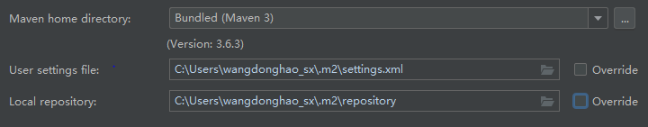

# Maven


---

## 第三方文件

### Libraries 库

在 Java 项目开发中，我们需要大量导入其他开发者已经完成的 Java 文件供自己使用。

为便于开发，我们把所有导入的第三方文件放入项目的 Libraries 库中， Java 程序通过 `import` 语句可以直接调用。

*指定 JDK 版本和文件储存位置后，JDK 文件也保存在 Libraries 库中。*

### JAR 文件

(Java Archive File) Java 的一种文档格式。实际是 Java 文件压缩后的 ZIP 文件，又名文件包。

Libraries 库里的第三方文件都是以 jar 文件形式保存，Java 程序导入时会自动解析其中的 Java 代码并使用。

---

## Maven

### Maven 功能

项目管理工具，为项目自动加载需要的 Jar 包。

用户只需要在配置文件中注明所需要的第三方文件和路径，Maven 会自动将 JAR 文件导入到项目的 Libraries 库中。

### Maven 配置

在 IDEA 的 Settings/Maven 中，可以对 Maven 进行配置：

1. **Maven 安装位置**：默认为 IDEA 自带，可配置为本地安装。
2. **XML 配置文件位置**
3. **Libraries 库位置**



### XML 文件

Maven 采用 XML 配置文件来注明项目所需要的第三方文件和路径。

```xml
<?xml version="1.0" encoding="UTF-8"?>
<project xmlns="http://maven.apache.org/POM/4.0.0"
         xmlns:xsi="http://www.w3.org/2001/XMLSchema-instance"
         xsi:schemaLocation="http://maven.apache.org/POM/4.0.0 http://maven.apache.org/xsd/maven-4.0.0.xsd">
    <modelVersion>4.0.0</modelVersion>
    
    <!-- 父项目坐标 -->
    <parent>
        <artifactId>stream-platform</artifactId>
        <groupId>com.company.stream</groupId>
        <version>1.1.1-SNAPSHOT</version>
    </parent>

    <!--项目标识符（生成路径）和 构件标识符 -->
    <groupId>com.company.stream</groupId>
    <artifactId>stream-platform-server</artifactId>

    <!-- 配置：可在其它位置导入。 -->
    <properties>
        <datatables.version>1.10.16</datatables.version>
        <font-awesome.version>4.7.0</font-awesome.version>
        <bootstrap.version>3.3.7</bootstrap.version>
        <jquery.version>3.2.1</jquery.version>
        <locator.version>0.32</locator.version>
        <mysql-connector.version>6.0.6</mysql-connector.version>
        <mysql.version>8.0.13</mysql.version>
        <c3p0.version>0.9.5.2</c3p0.version>
        <mybatis.version>1.3.1</mybatis.version>
        <lombok.version>1.16.20</lombok.version>
        <spring.boot.version>2.1.6.RELEASE</spring.boot.version>
    </properties>

    <!-- 资源仓库：依赖下载地址。 -->
    <repositories>
        <repository>
            <id>libs-release</id>
            <name>libs-release</name>
            <url>http://jfrog.cloud.company.domain/libs-release</url>
            <releases><enabled>false</enabled></releases>
            <snapshots><enabled>false</enabled></snapshots>
        </repository>
        <repository>
            <id>libs-release-company-maven-release</id>
            <name>libs-release-company-maven-release</name>
            <url>http://jfrog.cloud.company.domain/company-maven-cloudservice</url>
            <releases><enabled>false</enabled></releases>
            <snapshots><enabled>false</enabled></snapshots>
        </repository>
        <repository>
            <id>libs-snapshot</id>
            <name>libs-snapshot</name>
            <url>http://jfrog.cloud.company.domain/libs-snapshot</url>
            <releases><enabled>false</enabled></releases>
            <snapshots><enabled>true</enabled></snapshots>
        </repository>
    </repositories>

    <!-- 依赖管理：规定依赖的版本、类型等信息，但不会下载依赖。 -->
    <dependencyManagement>
        <dependencies>
            <dependency>
                <groupId>org.springframework.boot</groupId>
                <artifactId>spring-boot-dependencies</artifactId>
                <version>${spring.boot.version}</version>
                <type>pom</type>
                <scope>import</scope>
            </dependency>
            <dependency>
                <groupId>org.webjars</groupId>
                <artifactId>datatables</artifactId>
                <version>${datatables.version}</version>
            </dependency>
            <dependency>
                <groupId>mysql</groupId>
                <artifactId>mysql-connector-java</artifactId>
                <version>${mysql-connector.version}</version>
            </dependency>
            <dependency>
                <groupId>com.github.promeg</groupId>
                <artifactId>tinypinyin-lexicons-java-cncity</artifactId>
                <version>${tinypinyin.version}</version>
            </dependency>
            <dependency>
                <groupId>com.101tec</groupId>
                <artifactId>zkclient</artifactId>
                <version>${zkclient.version}</version>
                <exclusions>
                    <exclusion>
                        <groupId>org.slf4j</groupId>
                        <artifactId>slf4j-log4j12</artifactId>
                    </exclusion>
                </exclusions>
            </dependency>
        </dependencies>
    </dependencyManagement>

    <!-- 依赖：Maven 将从仓库自动下载以下依赖。 -->
    <dependencies>
        <dependency>
            <groupId>org.springframework.boot</groupId>
            <artifactId>spring-boot-starter-security</artifactId>
        </dependency>
        <dependency>
            <groupId>org.springframework.security</groupId>
            <artifactId>spring-security-test</artifactId>
            <scope>test</scope>
        </dependency>
        <dependency>
            <groupId>org.springframework.boot</groupId>
            <artifactId>spring-boot-starter-data-jpa</artifactId>
        </dependency>
        <dependency>
            <groupId>org.springframework.boot</groupId>
            <artifactId>spring-boot-starter-test</artifactId>
            <scope>test</scope>
            <exclusions>
                <exclusion>
                    <groupId>junit</groupId>
                    <artifactId>junit</artifactId>
                </exclusion>
            </exclusions>
        </dependency>
    </dependencies>

    <!-- 插件 -->
    <build>
        <pluginManagement>
            <plugins>
                <plugin>
                    <groupId>org.springframework.boot</groupId>
                    <artifactId>spring-boot-maven-plugin</artifactId>
                    <version>${spring.boot.version}</version>
                    <executions>
                        <execution>
                            <goals>
                                <goal>repackage</goal> 
                            </goals>
                        </execution>
                    </executions>
                </plugin>
                <plugin>
                    <groupId>org.mybatis.generator</groupId>
                    <artifactId>mybatis-generator-maven-plugin</artifactId>
                    <version>${generator.version}</version>
                    <configuration>
                        <configurationFile>src/main/resources/generatorConfig.xml</configurationFile>
                        <verbose>true</verbose>
                        <overwrite>true</overwrite>
                    </configuration>
                    <dependencies>
                        <dependency>
                            <groupId>mysql</groupId>
                            <artifactId>mysql-connector-java</artifactId>
                            <version>${mysql.version}</version>
                        </dependency>
                    </dependencies>
                </plugin>
            </plugins>
        </pluginManagement>
        <plugins>
            <plugin>
                <groupId>org.apache.maven.plugins</groupId>
                <artifactId>maven-compiler-plugin</artifactId>
                <configuration>
                    <source>1.8</source>
                    <target>1.8</target>
                </configuration>
            </plugin>
            <plugin>
                <groupId>org.mybatis.generator</groupId>
                <artifactId>mybatis-generator-maven-plugin</artifactId>
            </plugin>
        </plugins>
    </build>

</project>
```

### 发布

在 IDEA 界面右侧 MAVEN 选项，可将当前 MAVEN 项目模块发布到本地。 

名称和版本号为 pom.xml 中配置。


- `validate` 验证项目是否正确以及必须的信息是否可用
- `compile` 编译源代码
- `test` 测试编译后的代码，即执行单元测试代码
- `package` 打包编译后的代码，在target目录下生成package文件(jar)
- `integration-test` 处理package以便需要时可以部署到集成测试环境
- `verify` 检验package是否有效并且达到质量标准
- `install` 安装package到本地仓库，方便本地其它项目使用
- `deploy` 部署，拷贝最终的package到远程仓库和替他开发这或项目共享，在集成或发布环境完成


## maven插件：exec-maven-plugin

在执行 maven 命令时，我们可能还需要插入 Java 语句或者打包 npm 等，使用exec-maven-plugin 插件可插入。

```xml
<plugin>
    <groupId>org.codehaus.mojo</groupId>
    <artifactId>exec-maven-plugin</artifactId>
    <version>${exec.maven.plugin.version}</version>
    <executions>
        <execution>
            <id>npm install</id>    <!-- 指令标识 -->
            <goals>
                <goal>exec</goal>   <!-- Java 还是 exec -->
            </goals>
            <phase>generate-resources</phase>
            <!-- 要执行的命令 -->
            <configuration>
                <executable>npm</executable>
                <arguments>
                    <argument>install</argument>
                    <argument>--verbose</argument>
                </arguments>
            </configuration>
        </execution>
        <execution>
            <id>npm run build</id>
            <goals>
                <goal>exec</goal>
            </goals>
            <phase>generate-resources</phase>
            <configuration>
                <executable>npm</executable>
                <arguments>
                    <argument>run</argument>
                    <argument>build</argument>
                </arguments>
            </configuration>
        </execution>
    </executions>
</plugin>
```