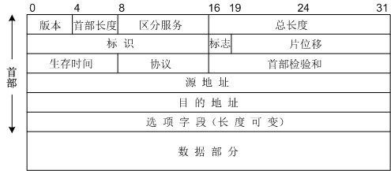

# 网络层

---

## 网络层功能

以路由器为中继系统连接不同结构的网络，统一使用 IP 协议进行相互通信。

传输层报文在网络层将被封装成 IP 数据报进行分组转发，路由器将根据 IP 地址选择转发路由。

---

## 路由选择协议

路由器通过查询路由表选择转发路由，当路由信息发生变化时，就需要路由器根绝路由选择协议动态更新路由表。

为方便选择转发路由，我们将互联网分为多个自治系统，在自治系统内可包含多个局域网。一个自治系统内所有网络一般都属于同一个行政单位，全部路由器在自治系统内都是联通的。

### 域间路由

负责在自治系统之间选择路由传递 IP 数据报。

- **BGP 协议**

应用层协议，基于 TCP 实现。只负责选择一条尽可能好的路径，将 IP 数据报传达到目标自治系统内。

### 域内路由

负责在自治系统内选择路由传递 IP 数据报。

- **RIP 协议**

应用层协议，基于 UDP 实现。相邻路由器之间会定时交换全部路由表信息。路由器会根据到达目的地址的最少跳数（经过路由器数量）来选择最短路由，更新自己的路由表信息。

使用简单方便。但最大跳数只支持 15（16 表示不可达），不适用于大型互联网。且会出现 “坏消息传得慢” 现象。

- **OSPF 协议**

网络层协议，使用 IP 数据报传输。

1. 相邻路由器之间会定时交互以确保对方可达（问候分组）。
2. 路由器刚开始工作时，会和相邻路由器交换路由信息（数据库描述分组），缺少数据时向相邻路由器索要（链路状态请求分组）。
3. 当链路状态发生变化时，路由器会向区域内的全部路由器发送路由表信息（链路状态更新分组），路由器收到后返回确认（链路状态确认分组）。

---

## IP 协议

IP 协议是网络层的核心协议，负责定义 IP 数据报的数据格式和传输规则。IP 协议无连接且不可靠。目前主要使用的 IP 协议版本为 IPv4 。

### IP 数据报

IP 数据报由首部和数据两部分组成。

首部长度为 20 + 4N 字节，含有以下字段：

- **版本**：4
- **首部长度** ：(4 bit) 单位 4B ，首部最大长度为 60 字节。
- **总长度**：(16 bit) 单位 1B ，IP 数据报最大长度为 65535 字节。 
- **标识**：(16 bit) 分片后的 IP 数据报使用同一个标识，以便组装。
- **标志**：(3 bit) 标志是否允许分片，以及是否是第一个分片。
- **片偏移**：(13 bit) 单位 8B ，标识分组分片后的偏移量，以便组装。
- **首部校验和**：(16 bit) 
- **生存时间 TTL**：(8 bit) IP 数据报剩余寿命，每次转发后自减。
- **协议**：(8 bit) 使用的上层协议，即数据报到达后交付者。1/ICMP 2/IGMP 6/TCP 17/UDP
- **源地址**：(32 bit)
- **目的地址**：(32 bit)

为什么分片：IP 数据报最大 65535 字节，但以太网帧限制为 1500 字节。

### IP 地址

在 IPv4 协议使用 32bit 的 IP 地址标识主机。IP 地址由网络号和主机号两部分组成，分为以下几种类型：

- **A 类地址 (1-126)**：8bit 网络号 + 24bit 主机号
- **B 类地址 (128-191)**：16bit 网络号 + 16bit 主机号
- **C 类地址 (192-223)**：24bit 网络号 + 8bit 主机号
- **D 类地址 (224-239)**：多播地址

#### 特殊地址

- `0.0.0.0` 和 `127.0.0.0` 表示当前主机
- `255.255.255.255` 表示当前网络的广播地址 
- 主机号全为 0 表示 指定网络本身： 例如 `202.98.174.0` 
- 主机号全为 1 表示 指定网络的广播地址：例如 `202.98.174.255` 

#### 子网编码 

为节省 IP 地址，IP 协议对网络内部进行了再划分，使一个网络号内部可以存储多个子网。IP 地址实际由网络号、子网号和主机号三部分组成。

在传输 IP 地址时，我们同样会发送 32bit 的子网掩码（前面全为 1 后面全为 0）来区分子网和主机。例如 IP 地址 `136.34.5.56` 的子网掩码为 `255.255.255.0` ，那么子网号就是 `136.34.5.0`.

#### 网址转换 NAT 

为节省 IP 地址，IP 协议允许专用网络内部采用私有 IP 地址标识主机，整个专用网络共享一个公用 IP 地址。

多个本地主机在公网共用一个 IP 地址，必须通过端口号来相互区分。公网 IP 地址/端口号和私有 IP 地址/端口号的对应关系保存在负责连接内外网的 NAT 路由器中，在转发 IP 数据报时会自动读取传输层报文并进行 NAT 转换：

- SNAT 本地主机向公网发送请求时，NAT 路由器转发时会修改源地址和端口号，切换为公有。
- DNAT 公网向本地主机发送请求时，NAT 路由器转发时会修改目的地址和端口号，切换为私有。

为此 IP 协议划分出了专用的私有地址供专用网络内部使用，在公网中指向私有地址的 IP 数据报不会被转发。

- **A 类私有地址 (10)**：例如 `10.98.174.0` 
- **B 类私有地址 (172.16-172.31)**：例如 `172.16.0.1` 
- **C 类私有地址 (192.168)**：例如 `192.168.0.1` 

#### IPv6

最新版本的 IP 协议 IPv6 可以从根本上解决 IP 地址短缺问题，改用 128 bit 的全新 IP 地址标识主机。

### 辅助协议

#### ARP 协议

网络层协议，负责映射 IP 地址和 MAC 地址。

主机会维护一个映射表记录同网络各主机 IP 地址和 MAC 地址的映射关系，通过查询映射表在网路内部转发 IP 分组。如果未记录则在局域网内部广播 ARP 请求，由目的主机返回其 IP 地址和 MAC 地址的映射关系。

#### DHCP 协议

基于 UDP 的传输层协议，为网络中的主机分配 IP 地址。

1. 主机启动时在网络内部广播 DHCP 发现消息：申请分配 IP 地址。
2. 网络内部的 DHCP 服务器接收到消息后广播 DHCP 提供消息：提供可分配的 IP 地址。
3. 主机接收到消息后广播广播 DHCP 请求消息：接受 IP 地址。
4. 网络内部的 DHCP 服务器接收到消息后广播 DHCP 确认消息：分配 IP 地址。

#### ICMP 协议

网络层协议，负责报告差错和异常情况，也可以用于询问(ping 指令)。

当 IP 数据报传输出现异常时，会生成 ICMP 报文封装为 IP 数据报发回源主机报告异常情况。

1. 数据分片后，只会对第一个分片的 IP 数据报报告差错。
2. 封装 ICMP 报文的 IP 数据报出错后不会报告差错，防止 ICMP 报文泛滥。
3. 组播 IP 数据报出现异常不会报告差错。

*策略可以有效防止 Smurf 攻击：攻击者在网络散播错误源地址的 Ping 请求，导致大量机器向源地址返回 ping 回复使源地址主机瘫痪。*

ICMP 报文的前 32 bit 信息是固定的，为 类型/编号/数据校验和。

