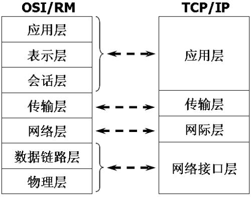

# 计算机网络

---

## 体系结构

在 ISO/OSI 和 TCP/IP 体系结构中，计算机网络被划分为多个层次。每层执行自己的功能，由下层向上层提供接口。

---

### 应用层

在特定的应用进程间传输报文实现数据交互，来完成特定的网络应用。

#### 常用协议

在应用层使用的协议类型多种多样，不同的协议执行不同的功能。最常使用的协议如下：

- **域名系统 DNS**：将域名和 IP 地址相互映射，使用户能够通过域名访问互联网。

- **超文本传输协议 HTTP**：发布和接收 HTML 页面，使用户能够通过浏览器浏览网页，默认端口 80。

- **电子邮件协议 SMTP**：发布和接收邮件。

---

### 传输层

将应用层的报文封装到传输层中，根据套接字（IP 地址 + 端口）建立两个主机进程之间的端对端通信。

传输层会自动对上层数据进行分用和复用：不同的应用层报文可封装到同一个传输层报文中传输，到达后再拆分报文交付给应用层中的各个进程。

#### TCP & UDP 协议

传输层主要使用 TCP 和 UDP 两种协议，两者区别如下：

- **TCP 提供可靠的、面向连接的服务**。

1. 在传送数据之前必须先建立连接，数据传送结束后要释放连接。接收方收到 TCP 报文会校验数据并返回确认，发送方可以根据情况控制发送速度。

2. 一般用于文件传输、发送和接收邮件、远程登录等场景。

- **UDP 提供不可靠但高效的、无连接的服务**。

1. 在传送数据之前不需要建立连接。接收方收到 UDP 报文后只核对报文检验和，如果出现错误直接丢弃，不需要返回任何确认。

2. 一般用于即时通信，如语音、视频、直播等场景。

---

### 网络层

把传输层的报文分组封装成 IP 数据报，根据 IP 地址在网络中选择合适的路由进行传输。

#### IP 协议

是网络层的核心协议。目前主要使用版本为 IPv4，使用 32bit 的 IP 地址标识主机。  

---

## 数据链路层

将网络层交下来的 IP 数据报组装成帧，根据 MAC 地址建立网络中两个相邻节点间的点对点传输。

同时也会对传输帧进行基本的差错检测。如果发现差错，数据链路层就简单地丢弃这个出了差错的帧，以避免继续在网络中传送下去白白浪费网络资源。如果需要改正数据在链路层传输时出现差错（这就是说，数据链路层不仅要检错，而且还要纠错）

---

## 物理层

实现相邻计算机节点之间比特流的透明传送，尽可能屏蔽掉具体传输介质和物理设备的差异。

